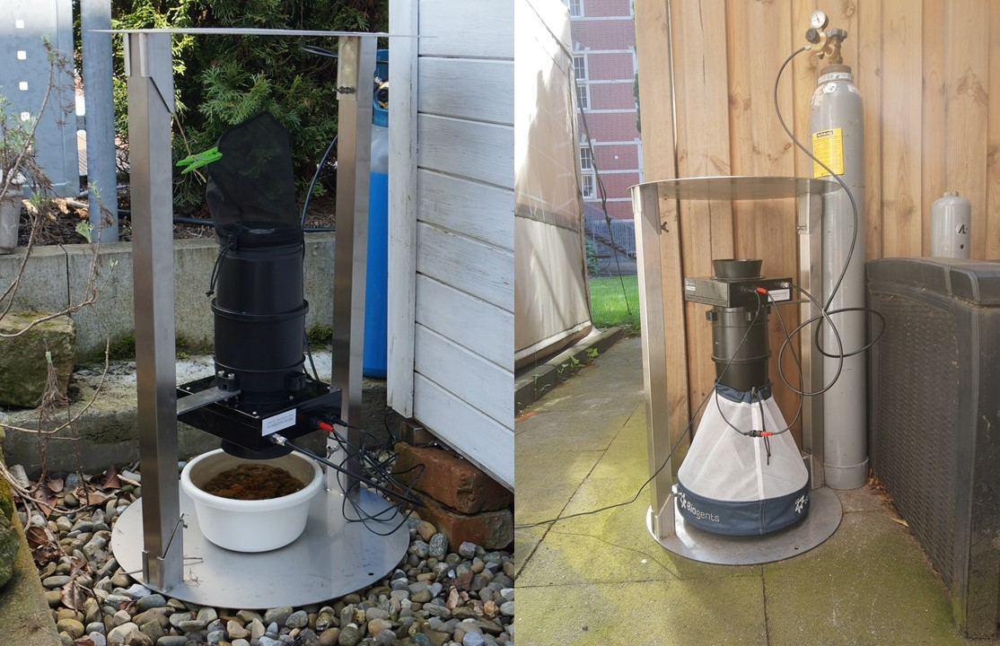
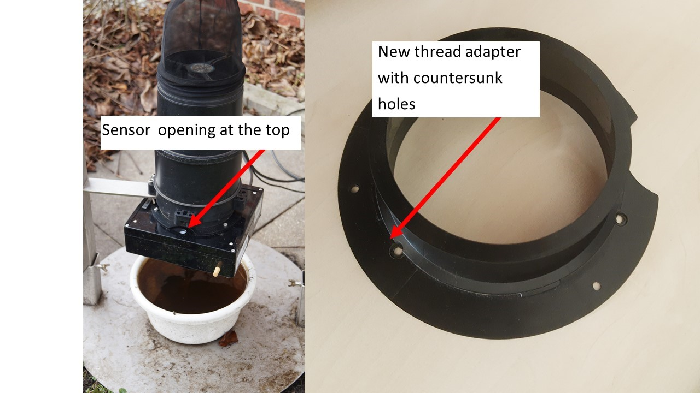

```{r setup, include=FALSE}
library(ggplot2)
library(ggdist)
library(rstatix)
library(ggpubr)
library(lubridate)
library(dplyr)
library(tidyr)
library(vegan)
library(scales)
library(lme4)
library(knitr)
library(kableExtra)
marg<-1
small<-35

ID_split<- function(df,ID){
  split<-data.frame(cbind(do.call('rbind',
  strsplit(as.character(df$ID), '.' ,fixed=TRUE)),df))
 
  }

```


```{r identification, echo=FALSE, warning=FALSE, message=FALSE, include=F}

### Data Wrangling merging Counter Data with Identifications 
## All in Julian Day
#read in Identification csv file
ident<- read.csv2("NEED_raw_21v2.csv")

# extract important information from identifications
ident2<-as.data.frame(cbind(ID=ident$ID, Intervall=ident$Intervall,
                          days=ident$Fangtage,
                          identified=ident$number))
#changing collumn classes
ident2$ID<- as.factor(ident$ID)
ident2$Intervall<-as.factor(ident$Intervall)
ident2$days<-as.numeric(ident2$days)
ident2$identified<- as.numeric(ident2$identified)


# Extracting information from catch ID
ident2idsplit<- data.frame(cbind(do.call('rbind',strsplit(as.character(ident2$ID), '.' ,fixed=TRUE)),ident2))
ident2idsplit$fakeid<-ident2idsplit$ID
identnames<-c("Project","Year","Location","Trap","Intervall","timepoint")
names(ident2idsplit)[1:6]<- identnames
## subtract one Day from NEED1
ident2idsplitne1<- subset(ident2idsplit, ident2idsplit$Location==1)
ident2idsplitne1$timepoint<- as.numeric(ident2idsplitne1$timepoint)-1
# add new time to ID
ident2idsplitne1$ID<- paste(ident2idsplitne1$Project,ident2idsplitne1$Year,
                            ident2idsplitne1$Location, ident2idsplitne1$Trap,
                            ident2idsplitne1$Intervall, ident2idsplitne1$timepoint,
                            sep = ".")
#delete old Location 1 from df
test<-subset(ident2idsplit, Location!="1")
test$timepoint<- as.numeric(test$timepoint)
test$ID<- as.character(test$ID)
names(ident2idsplitne1)[8]<-"Rythm"
names(test)[8]<-"Rythm"

# add new Location 1 with altered time to df
ident2idsplit<-rbind(ident2idsplitne1,test)

# Resolve identical colnames
names(ident2idsplit)[8]<- "Rythm"

#sum up all mosquito species identified per trapping event
fullident<- ident2idsplit%>%
  group_by(Project,Year,Location,Trap,Intervall,timepoint,ID,
           fakeid, days)%>%
  summarise(number=sum(identified))
```


```{r, include=F}
#rename catchlabels with obvious errors
#Location 14
fullident$fakeid<-as.character(fullident$fakeid)
fullident$timepoint[fullident$timepoint == 16 & fullident$Trap=="PG" & fullident$Year==21 & fullident$Location=="14"] <- "19"

fullident$ID[fullident$ID=="NE.21.14.PG.K.16"]<-"NE.21.14.PG.K.19"
fullident$fakeid[fullident$fakeid=="NE.21.14.PG.K.16"]<-"NE.21.14.PG.K.19"

fullident$timepoint[fullident$timepoint == 18 & fullident$Trap=="PG" & fullident$Year==21 & fullident$Location=="14"] <- "21"
fullident$ID[fullident$ID=="NE.21.14.PG.K.18"]<-"NE.21.14.PG.K.21"
fullident$fakeid[fullident$fakeid=="NE.21.14.PG.K.18"]<-"NE.21.14.PG.K.21"

fullident$timepoint[fullident$timepoint == 20 & fullident$Trap=="PG" & fullident$Year==21 & fullident$Location=="14"] <- "23"
fullident$ID[fullident$ID=="NE.21.14.PG.K.20"]<-"NE.21.14.PG.K.23"
fullident$fakeid[fullident$fakeid=="NE.21.14.PG.K.20"]<-"NE.21.14.PG.K.23"

fullident$timepoint[fullident$timepoint == 22 & fullident$Trap=="PG" & fullident$Year==21 & fullident$Location=="14"] <- "25"
fullident$ID[fullident$ID=="NE.21.14.PG.K.22"]<-"NE.21.14.PG.K.23"
fullident$fakeid[fullident$fakeid=="NE.21.14.PG.K.22"]<-"NE.21.14.PG.K.23"

fullident$timepoint[fullident$timepoint == 24 & fullident$Trap=="PG" & fullident$Year==21 & fullident$Location=="14"] <- "29"
fullident$ID[fullident$ID=="NE.21.14.PG.K.24"]<-"NE.21.14.PG.K.29"
fullident$fakeid[fullident$fakeid=="NE.21.14.PG.K.24"]<-"NE.21.14.PG.K.29"

fullident$timepoint[fullident$timepoint == 26 & fullident$Trap=="PG" & fullident$Year==21 & fullident$Location=="14"] <- "31"
fullident$ID[fullident$ID=="NE.21.14.PG.K.26"]<-"NE.21.14.PG.K.31"
fullident$fakeid[fullident$fakeid=="NE.21.14.PG.K.26"]<-"NE.21.14.PG.K.31"

fullident$timepoint[fullident$timepoint == 28 & fullident$Trap=="PG" & fullident$Year==21 & fullident$Location=="14"] <- "33"
fullident$ID[fullident$ID=="NE.21.14.PG.K.28"]<-"NE.21.14.PG.K.33"
fullident$fakeid[fullident$fakeid=="NE.21.14.PG.K.28"]<-"NE.21.14.PG.K.33"

fullident$timepoint[fullident$timepoint == 30 & fullident$Trap=="PG" & fullident$Year==21 & fullident$Location=="14"] <- "35"
fullident$ID[fullident$ID=="NE.21.14.PG.K.30"]<-"NE.21.14.PG.K.35"
fullident$fakeid[fullident$fakeid=="NE.21.14.PG.K.30"]<-"NE.21.14.PG.K.35"

fullident$timepoint[fullident$timepoint == 34 & fullident$Trap=="PG" & fullident$Year==21 & fullident$Location=="14"] <- "37"
fullident$ID[fullident$ID=="NE.21.14.PG.K.34"]<-"NE.21.14.PG.K.37"
fullident$fakeid[fullident$fakeid=="NE.21.14.PG.K.34"]<-"NE.21.14.PG.K.37"

fullident$timepoint[fullident$timepoint == 36 & fullident$Trap=="PG" & fullident$Year==21 & fullident$Location=="14"] <- "39"
fullident$ID[fullident$ID=="NE.21.14.PG.K.36"]<-"NE.21.14.PG.K.39"
fullident$fakeid[fullident$fakeid=="NE.21.14.PG.K.36"]<-"NE.21.14.PG.K.39"

ident_25<- subset(fullident, fullident$Location=="25")
ident_25$date<-as.Date(as.numeric(ident_25$timepoint)-2440588, origin ="1970-01-01")

```


```{r counter, echo=FALSE, warning=FALSE, message=FALSE, include=F}
# read in counter data csv as data.frame
counter<- read.csv2("Trap_data_Sicherheitskopie_12,10,2021_anonym3.csv")

counter2<-counter
#generating new column for time transformation 
counter2$datestart<-paste(counter$date,counter$start,sep = ":")
# convert to time and date format
counter2$datestart<- strptime(counter2$datestart, format = '%d.%m.%Y:%H:%M')
#convert time in seconds since ...
counter2$datestart<- as.numeric(counter2$datestart)
# subtract 12 hours worth of seconds
counter2$datestart2<-counter2$datestart-43200
# transform back to date and time
counter2$datestart2<- as.POSIXct(counter2$datestart2, origin ="1970-01-01" )
# write altered date to old df
counter$date<- format(counter2$datestart2, format="%Y/%m/%d")
#write altered time to old df
counter$start<-format(counter2$datestart2, format="%H:%M")

#repeat above code for endtime
counter2$dateend<-paste(counter$date,counter$end,sep = ":")
counter2$dateend<- strptime(counter2$dateend, format = '%Y/%m/%d:%H:%M')
counter2$dateend<- as.numeric(counter2$dateend)
counter2$dateend2<-counter2$dateend-43200
counter2$dateend2<- as.POSIXct(counter2$dateend2, origin ="1970-01-01" )

counter$end<- format(counter2$dateend2, format="%H:%M")


# extract important information from data.frame
count<- as.data.frame(cbind(date=counter$date,
                            name=counter$trap_name,
                            number=counter$mosquitoes))
# new df with 15 minute intervalls
count_day<- as.data.frame(cbind(date=counter$date,
                                time=counter$end,
                                name=counter$trap_name,
                                number=counter$mosquitoes))
count_day$name<- as.factor(count_day$name)

#changing class of columns
count$number<-as.numeric(count$number)
count$name<-as.factor(count$name)
count$date<-as.Date(count$date)

# creating list of new trap names "locs" and changing them in data.frame
levels(count$name)<-locs<- list("NE..1.PG."="NEED_1_PG",
                                "NE..1.PR."="NEED_1_R_BG_new_normal",
                                "NE..10.PG"="NEED_10_Gravid",
                                "NE..10.PG"="NEED_10_Gravid_new",
                                "NE..11.PG"="NEED_11_Gravid",
                                "NE..11.PR"="NEED_11_Pro",
                                "NE..12.PG"="NEED_12_Gravid",
                                "NE..14.PG"="NEED_14_Gravid",
                                "NE..15.PG"="NEED_15_Gravid",
                                "NE..16.PG"="NEED_16_Gravid",
                                "NE..18.PG"="NEED_18_Gravid",
                                "NE..19.PG"="NEED_19_Gravid",
                                "NE..2.PG"="NEED_2_PG",
                                "NE..2.PR"="NEED_2_PR",
                                "NE..23.PG"="NEED_23_F_U, counter gravid",
                                "NE..25.PR"="NEED_25_Pro",
                                "NE..27.PR"="Need_27_Pro",
                                "NE..3.PG"="NEED_3 PG",
                                "NE..3.PR"="NEEd_3 PR",
                                "NE..4.PG"="NEED_4_D_L, BG gravid",
                                "NE..5.PG"="NEED_5_A_L, bg pro gravid",
                                "NE..5.PR"="NEED_5_A_L, bg pro normal",
                                "NE..7.PG"="NEED_7_Gravid",
                                "NE..7.PR"="NEED_7_Pro" ,
                                "NE..8.PG"="NEED_8_Gravid",
                                "NE..8.PR"="NEED_8_Pro",
                                "NE..9.PG"="NEED_9_Gravid",
                                "NE..9.PR"="NEED_9_Pro",
                                "NE..6.PG"="T_H_gravid",
                                "NE..6.PR"="T_H_Pro")

#creating names for the ID split
countnames<-c("Project","Year","Location","Trap")
# spliting trap name for ID creation
countidsplit<-data.frame(cbind(do.call('rbind',strsplit(as.character(count$name), '.' ,fixed=TRUE)),
                          count))
#renaming columns of split Trap name
names(countidsplit)[1:4]<- countnames
# Extracting Year from Counter timestamp
countidsplit$Year<-format(countidsplit$date, format="%y")
#Calculating Julian day from Counter timestamp
countidsplit$timepoint<- as.numeric(countidsplit$date)+2440588
#creating ID
countidsplit$ID<-paste(countidsplit$Project,countidsplit$Year, countidsplit$Location,
                       countidsplit$Trap, "J",countidsplit$timepoint, sep = ".")
#Extracting Calender week(CW) from Counter timestamp
countidsplit$KW<-strftime(countidsplit$date,format="%V")
# Sum the count per day to compare to  identification per capturing net
countperday<- countidsplit%>%
  group_by(Project,Year,Location,Trap,date,timepoint,ID,KW)%>%
  summarise(number=sum(number))%>%
  ungroup()
  

# creating fake ID in Counter data to match with CW ID from identifications
countperday$fakeid<-as.factor(paste(countperday$Project, countperday$Year,
                            countperday$Location,countperday$Trap,
                            "K",countperday$KW, sep = "."))


```


```{r, include=F}
#rename fakeid with obvious errors
countperday$fakeid[countperday$fakeid=="NE.21.14.PG.K.18"]<-"NE.21.14.PG.K.19"

```


```{r merging counter and identification, echo=FALSE, warning=FALSE, message=FALSE, include=F}
# merge identifications with counter information by the fake ID for CW
countnident<-merge(fullident, countperday, by="fakeid", all = T)
a<-fullident [ !fullident$ID %in% countperday$ID ,]

# extracting the overlaps
afulldf<- na.omit(countnident)

#summing up the counts of two days two single ID since traps run during two dates
afulldf2<- afulldf%>%
  group_by(ID.x)%>%
  summarise(number=sum(number.y))
names(afulldf2)[2]<- "countsum"
# deleting the second row to get single row per trapping event although they were on two dates
fulldfdub = afulldf[!duplicated(afulldf$ID.x),]
#merging the identifications per trapping event with the counts per trapping event
#for the new julian day ID of the CW catches
akwtranslated<-merge(afulldf2,fulldfdub, all = T)
# extracting essential information with new julian day ID of the CW catches
akwtranslated2<- as.data.frame(cbind(ID=akwtranslated$ID.y,
                                     Project=akwtranslated$Project.x,
                                     Year=akwtranslated$Year.x,
                                     Location=akwtranslated$Location.x,
                                     Trap=akwtranslated$Trap.x,
                                    Timescale=akwtranslated$Intervall,
                                    jday=akwtranslated$timepoint.y,
                                    Counted=akwtranslated$countsum,
                                    Identified=akwtranslated$number.x))
#creating seperated df for plotting with "Counted" and "Identified" as factor for CW catches
akwtranslated2_plot<- as.data.frame(rbind(cbind(
                       ID=akwtranslated$ID.y,
                       Project=akwtranslated$Project.x,
                       Year=akwtranslated$Year.x,
                       Location=akwtranslated$Location.x,
                       Trap=akwtranslated$Trap.x,
                       Timescale=akwtranslated$Intervall,
                       jday=akwtranslated$timepoint.y,
                       number=akwtranslated$countsum,
                       method="Counted"),
                       cbind(ID=akwtranslated$ID.y,
                          Project=akwtranslated$Project.x,
                          Year=akwtranslated$Year.x,
                          Location=akwtranslated$Location.x,
                          Trap=akwtranslated$Trap.x,
                          Timescale=akwtranslated$Intervall,
                          jday=akwtranslated$timepoint.y,
                          number=akwtranslated$number.x,
                          method="Identified")
                       ))

# merging counter data with identification data for daily captures
fullj<-merge(fullident,countperday, by="ID", all = T)%>%
  na.omit(fullj)
# extracting important information for daily captures (Counter and Identification)
afullj<- as.data.frame(cbind(ID=as.character(fullj$ID),Project=fullj$Project.x,
                             Year=fullj$Year.x,Location=fullj$Location.x,
                             Trap=fullj$Trap.x,
                             Timescale=fullj$Intervall, jday=fullj$timepoint.x,
                             Counted=fullj$number.y,Identified=fullj$number.x))
# creating new table for plots with "counted" and "Identified as factor
afullj_plot<-as.data.frame(rbind(cbind(
                             ID=as.character(fullj$ID),
                             Project=fullj$Project.x,
                             Year=fullj$Year.x,
                             Location=fullj$Location.x,
                             Trap=fullj$Trap.x,
                             Timescale=fullj$Intervall, jday=fullj$timepoint.x,
                             number=fullj$number.y,method="Counted"),
                             cbind(
                             ID=as.character(fullj$ID),
                             Project=fullj$Project.x,
                             Year=fullj$Year.x,Location=fullj$Location.x,
                             Trap=fullj$Trap.x,
                             Timescale=fullj$Intervall, jday=fullj$timepoint.x,
                             number=fullj$number.x,method="Identified" )))
# combining the daily catches with the translated CW catches
final_lm<-as.data.frame(rbind(afullj, akwtranslated2))
#write.csv(final_lm,"final_lm_time_travel.csv", row.names = TRUE)
#combining the daily catches with the translated CW catches for plots
final_plot<-as.data.frame(rbind(afullj_plot,akwtranslated2_plot))
#write.csv(final_plot,"final_plot_time_travel.csv", row.names = TRUE)
test<-subset(ident, Location==3&Trap=="PG")
levels(as.factor(test$timepoint))
#daiys
#write.csv(count_day,"dailys.csv", row.names = TRUE)
a<-subset(final_plot, final_plot$Location=="25")
```


```{r, include=F}
#unavailable counter data
# final lm is identified with corresponding counter data 862 obs
cor_days<-final_lm%>%
  dplyr::group_by(Location, Trap)%>%
  dplyr::summarise("cor_days"=length((levels(as.factor(ID)))))%>%
  ungroup()
cor_days$Location<-as.numeric(cor_days$Location)
# data with identified but not counted
lost<- anti_join(fullident, countperday, by="fakeid")
 # all identifications from counter data timerange
i<-subset(fullident, Year==21&!Trap=="SE"&!Trap=="SC"&
                timepoint>=2459321&timepoint<=2459500)
i$fakeid<-as.character(i$ID)
ident_days<-i%>%
  dplyr::group_by(Location, Trap)%>%
  dplyr::summarise("ident_days"=length((levels(as.factor(ID)))))%>%
  ungroup()
ident_days$Location<-as.numeric(ident_days$Location)


```

```{r, include=F}
abl<-merge(fullident, countperday, by="fakeid", all = T)
abl<-na.omit(abl)
abl = abl[!duplicated(abl$fakeid),]

bbl<-merge(fullident, countperday, by="ID", all = T)
bbl<-na.omit(bbl)
bbl = bbl[!duplicated(bbl$ID),]
names(abl)<-names(bbl)
cor_days<-as.data.frame(rbind(abl,bbl))


cor_days2<-cor_days%>%
  dplyr::group_by(Location.x, Trap.x)%>%
  dplyr::summarise("cor_days"=length((levels(as.factor(ID)))))%>%
  ungroup()

fullident$timepoint<-as.numeric(fullident$timepoint)
i<-subset(fullident, Year==21&!Trap=="SE"&!Trap=="SC"&
                timepoint>=2459321&timepoint<=2459500)

i2<-subset(fullident, Year==21&!Trap=="SE"&!Trap=="SC"&
                     timepoint>=16&timepoint<=40)
ii<- as.data.frame(rbind(i,i2))

ident_days<-ii%>%
  dplyr::group_by(Location, Trap)%>%
  dplyr::summarise("ident_days"=length((levels(as.factor(ID)))))%>%
  ungroup()

names(cor_days2)<-c("Location","Trap","cor_days")
jj<-left_join(cor_days2, ident_days, by=c("Location","Trap"))
jj$perc<- round((jj$cor_days/jj$ident_days)*100, digits = 1)

names(jj)<-c("Location","Trap","Days transmitted","Days captured", "Transmission succcess")
sum(jj$`Days transmitted`)

trans_succ<- mean(jj$`Transmission succcess`)
c<-levels(as.factor(cor_days2$Location))
jj$Trap<- gsub("PG","CO2-Pro-gravid",jj$Trap)
jj$Trap<- gsub("PR","CO2-Pro",jj$Trap)

mean_trans_day<- t.test(jj$`Days transmitted`)
mean_capt_day<- t.test(jj$`Days captured`)
mean_trans_suc<- t.test(jj$`Transmission succcess`)
mea<- as.vector(rbind("Mean"," ",
                    paste0(round(mean_trans_day$estimate[1],1),
                    " (CI:",round(mean_trans_day$conf.int[1],1)," - ",
                    round(mean_trans_day$conf.int[2],1),")"),
                    paste0(round(mean_capt_day$estimate[1],1),
                    " (CI:",round(mean_capt_day$conf.int[1],1)," - ",
                    round(mean_capt_day$conf.int[2],1),")"),
                    paste0(round(mean_trans_suc$estimate[1],1),
                    " (CI:",round(mean_trans_suc$conf.int[1],1)," - ",
                    round(mean_trans_suc$conf.int[2],1),")")))
jj2<-rbind(jj,mea)


jj2$Location<-recode_factor(as.factor(jj2$Location),"1" = "Hamburg 1", "2" = "Neu Wulmsdorf",
                                              "3" = "Hamburg 2", "4" = "Varel 1",
                                              "5" = "Großheide", "6" = "Gronau Landau",
                                              "7" = "Buchholz", "8" = "Weinheim",
                                              "9" = "Tübingen", "10" = "Fürth",
                                              "11" = "Landau", "12" = "Düsseldorf",
                                              "14" = "Berlin", "15" = "Regensburg",
                                               "16" = "March", "18" = "Friedberg",
                                               "19" = "Konstanz", "23" = "Varel 2",
                                               "25" = "Wittenberg", "27" = "Hamburg 3" )
#write_excel_csv2(jj2, "transmission_success.csv")
```


```{r, include=F}
###General info to need
need<- ident

```


```{r table, echo=FALSE, warning=FALSE, message=FALSE, include=F}
### upload and categorise and accuracy

dfplot_tt<- final_plot
dfplot_tt$Location<- as.factor(dfplot_tt$Location)

dfplot_tt$Date<-as.Date(as.numeric(dfplot_tt$jday)-2440588, origin = "1970-01-01")
dfplot_tt$size<-ifelse(dfplot_tt$number<=10,"small", "large")


dfan_tt<-final_lm
dfan_tt$Location<-as.factor(dfan_tt$Location)
dfan_tt$size<-ifelse(dfan_tt$Identified<=10,"small", "large")

dfan_tt$Identified<-as.numeric(dfan_tt$Identified)
dfan_tt$Counted<-as.numeric(dfan_tt$Counted)
accuracy<-ifelse(dfan_tt$Identified>dfan_tt$Counted,((dfan_tt$Counted/dfan_tt$Identified)*100),
                 ((dfan_tt$Identified/dfan_tt$Counted)*100))
accuracy<-ifelse(dfan_tt$Counted==0 &dfan_tt$Identified==0,100,
                  accuracy  )

dfan_tt<-as.data.frame(cbind(dfan_tt, accuracy))

#actab$accuracy<-as.numeric(actab$accuracy)
dfan_tt$jday<-as.numeric(dfan_tt$jday)-2440588
dfan_tt$date<-as.Date(dfan_tt$jday, origin = "1970-01-01" )

dfan_tt$month<-month(as.POSIXlt(dfan_tt$date, format="%Y-%M-%D"))

samples<-dfan_tt%>%
  group_by(Location, Trap)%>%
  summarise(samples=length(Location))%>%
  ungroup()


```


```{r, include=F}
###values and tables
datapoints<-nrow(dfan_tt[ !duplicated(dfan_tt$ID),])


daily_accuracy<- as.data.frame(cbind(min=min(dfan_tt$accuracy),
                                     max=max(dfan_tt$accuracy),
                                     mean=mean(dfan_tt$accuracy),
                                     median=median(dfan_tt$accuracy)))
daily_mean_ac<-mean(dfan_tt$accuracy)
daily_mean_id<-mean(dfan_tt$Identified)
location_accuracy<-dfan_tt%>%
  group_by(Location, Trap)%>%
  summarise(min=min(accuracy),
            max=max(accuracy),
           mean=mean(accuracy),
           median=median(accuracy))%>%
  ungroup()

size_acc<-dfan_tt%>%
  group_by(size)%>%
  summarise(mean=mean(accuracy))%>%
  ungroup()

mean_accuracy<- mean(dfan_tt$accuracy)

#need$species[is.na(need$species)]<-"unidentified males"
need$species[need$species=="Na"]<- "unidentified males"
need$species<- ifelse(need$sex=="male","unidentified males", need$species)
need<-subset(need, need$species!="?")
need<-subset(need, need$species!="Simulidae")
need<-subset(need, need$species!="")
need<-subset(need, need$species!="0")
caught_taxa<- subset(need, need$Year=="21"&!need$Trap=="SC"&!need$Trap=="SE")%>%
  group_by(species, Trap)%>%
  summarise(amount=sum(number))%>%
  ungroup()
caught_taxa2<- caught_taxa%>%
  pivot_wider(names_from = "Trap", values_from = "amount")


mosquitoes_per_trap<- caught_taxa%>%
            group_by(Trap)%>%
            summarise(sum(amount))%>%
            ungroup()


perc_PR<- as.data.frame(sapply(caught_taxa2$PR,function(x) x/mosquitoes_per_trap[2,2]*100), col.names = F)
perc_PG<-as.data.frame(sapply(caught_taxa2$PG,function(x) x/mosquitoes_per_trap[1,2]*100), col.names = F)
perc_Trap<- t(rbind(round(perc_PG,1),round(perc_PR,1) ))
caught_taxa3<- cbind.data.frame(caught_taxa2, perc_Trap)
names(caught_taxa3)[4]  <- "PG %"
names(caught_taxa3)[5]  <- "PR %"
names(caught_taxa3)[1]  <- "Species"
caught_taxa3<- caught_taxa3[,c(1,3,5,2,4)]
caught_taxa3.2<- caught_taxa3[,c(1,3,5,2,4)]
caught_taxa3[is.na(caught_taxa3)] <- 0
caught_taxa3[] <- lapply(caught_taxa3, as.character)
caught_taxa3$`PG %`<- paste0("(",caught_taxa3$`PG %`,")")
caught_taxa3$`PR %`<- paste0("(",caught_taxa3$`PR %`,")")
su2<-c("Sum",sum(as.numeric(caught_taxa3$PR)),"",sum(as.numeric(caught_taxa3$PG)),"")
caught_taxa3.1<- rbind(caught_taxa3,su2)
caught_taxa4<- unite(caught_taxa3.1, PR, c("PR","PR %"), sep = " ")
caught_taxa4<- unite(caught_taxa4, PG, c("PG","PG %"), sep = " ")


#write.csv2(caught_taxa4,"caught_taxa.csv", row.names = F)

mosquitoes<- sum(caught_taxa$amount)
perc_pip<- ((caught_taxa[3][caught_taxa$species=="Cx. pipiens s.l.",])/mosquitoes)*100
#caught_tab<- gt(caught_taxa)

mean_daily_mosq<- mean(dfan_tt$Identified)
```


```{r, include=F}
###Linear regression predicting captured by counted
lineaall<-lm(log1p(Identified)~log1p(Counted),dfan_tt)
lineaall_sum<-summary(lineaall)


lineaplt<- ggplot(dfan_tt, aes(x=log1p(Counted), y=log1p(Identified)))+
  labs(x="BG-Counter 2 (log1p)", y="Captured mosquitoes (log1p)")+
  geom_point(size=3)+
  geom_smooth(method = "lm", size=2)+
  #stat_regline_equation(label.x.npc = "left", size=16, face="bold")+
  theme_classic()
lineaplt<- lineaplt+theme(legend.title = element_blank(),
               legend.text = element_text(size = 20, face = "bold"),
               axis.text = element_text(size = 30, face = "bold"),
               axis.title = element_text(size = 30, face = "bold"),
               title =   element_text(size = 25, face = "bold"))+
  scale_color_brewer(palette = "Dark2")

lineaplt


# ggsave(
#   "lm_plot.jpg",
#   width = 16,
#   height = 9,
#   dpi = 1000
# )


```


```{r lm sufficient, echo=FALSE, warning=FALSE, message=FALSE, include=F}
###correlation only sites with enough samplingsize
dfan_tt$Trap<-as.factor(dfan_tt$Trap)

tes<-dfan_tt %>%
     group_by(Trap, Location) %>%
     summarize(N=length(Location))

dfan_tt_len <- merge(dfan_tt,tes,by=c("Location","Trap"))


dfan_tt_suff<- subset(dfan_tt_len, dfan_tt_len$N>9)
nrow(subset(dfan_tt_suff, dfan_tt_suff$size=="small"))
nrow(subset(dfan_tt_suff, dfan_tt_suff$size=="large"))
crtab<-dfan_tt_suff%>%
  group_by(Trap,Location)%>%
  summarise(cor=cor(Counted, Identified, method = "spearman"))


location_suff_cor<-dfan_tt_suff%>%
  group_by(Location, Trap)%>%
  cor_test(Counted, Identified, method = "spearman")


# Big table with lm and cor
rsq <- function(x, y) summary(lm(y~x))$r.squared
p.value<- function(x, y) summary(lm(y~x))$coefficients[2,4]
est<-function(x, y) summary(lm(y~x))$coefficients[2,1]

location_suff_lm<-dfan_tt_suff %>%
  group_by(Location, Trap) %>%
  summarise(rsq=rsq(log1p(Identified),log1p(Counted)),
            pv=p.value(log1p(Identified),log1p(Counted)),
            est=est(log1p(Identified),log1p(Counted)),
            ac= mean(accuracy), "Trap days"= mean(N), "Captured mosquitoes"=sum(Identified), " Mean Captured mosquitoes"=mean(Identified))%>%
  ungroup()


tot_tab<- cbind(location_suff_lm, location_suff_cor$cor, location_suff_cor$p)
tot_names<-c("Location", "Trap", "lm: R-squared","lm: p-value", "lm: Estimate",
              "Accuracy (%)","Trap days","Captured mosquitoes","Mean captured mosquitoes","Spearman Correlation", "cor: p-value")
names(tot_tab)<-tot_names

tot_tab$`Accuracy (%)`<-round(tot_tab$`Accuracy (%)`,1)
tot_tab$`lm: p-value`<- as.numeric(tot_tab$`lm: p-value`)
tot_tab$`cor: p-value`<- as.numeric(tot_tab$`cor: p-value`)
tot_tab<-tot_tab %>% mutate_at(vars("lm: R-squared", "lm: Estimate",
             "Spearman Correlation", "Mean captured mosquitoes"), funs(round(., 3)))
tot_tab1<-tot_tab

tot_tab$`lm: p-value`<-pvalue(tot_tab$`lm: p-value`, accuracy = 0.0001, add_p = F)
tot_tab$`cor: p-value`<-pvalue(tot_tab$`cor: p-value`, accuracy = 0.0001, add_p = F)

tot_tab[,3:7]<-format(tot_tab[,3:7], decimal.mark=".")
tot_tab<- tot_tab[,c(1,2,7,8,9,3,4,5,6,10,11)]
tot_tab[] <- lapply(tot_tab, as.character)

mean_days<- t.test(as.numeric(tot_tab$`Trap days`))
mean_mos<- t.test(as.numeric(tot_tab$`Captured mosquitoes`))
mean_Rsqr<- t.test(as.numeric(tot_tab$`lm: R-squared`))
mean_ac<- t.test(as.numeric(tot_tab$`Accuracy (%)`))
mean_cor<- t.test(as.numeric(tot_tab$`Spearman Correlation`))

mea<- as.vector(rbind("Mean"," ",
                    paste0(round(mean_days$estimate[1],1),
                    " (CI:",round(mean_days$conf.int[1],1)," - ",
                    round(mean_days$conf.int[2],1),")"),
                    paste0(round(mean_mos$estimate[1],1),
                    " (CI:",round(mean_mos$conf.int[1],1)," - ",
                    round(mean_mos$conf.int[2],1),")"),"",
                    paste0(round(mean_Rsqr$estimate[1],1),
                    " (CI:",round(mean_Rsqr$conf.int[1],1)," - ",
                    round(mean_Rsqr$conf.int[2],1),")"),
                    "","",
                    paste0(round(mean_ac$estimate[1],1),
                    " (CI:",round(mean_ac$conf.int[1],1)," - ",
                    round(mean_ac$conf.int[2],1),")"),
                    paste0(round(mean_cor$estimate[1],1),
                    " (CI:",round(mean_cor$conf.int[1],1)," - ",
                    round(mean_cor$conf.int[2],1),")"),"")
                )
su<-as.vector(rbind("Sum","",paste0(round(sum(as.numeric(tot_tab$`Trap days`)),1)),
                    paste0(round(sum(as.numeric(tot_tab$`Captured mosquitoes`)),1))
                    ,"","","","","","","")
              )
tot_tab2<-rbind(tot_tab,mea,su)
tot_tab2$Location<-recode_factor(as.factor(tot_tab2$Location),"1" = "Hamburg 1", "2" = "Neu Wulmsdorf",
                                              "3" = "Hamburg 2", "4" = "Varel 1",
                                              "5" = "Großheide", "6" = "Gronau Landau",
                                              "7" = "Buchholz", "8" = "Weinheim",
                                              "9" = "Tübingen", "10" = "Fürth",
                                              "11" = "Landau", "12" = "Düsseldorf",
                                              "14" = "Berlin", "15" = "Regensburg",
                                               "16" = "March", "18" = "Friedberg",
                                               "19" = "Konstanz", "23" = "Varel 2",
                                               "25" = "Wittenberg", "27" = "Hamburg 3" )
                
tot_tab2$Trap<-recode_factor(as.factor(tot_tab2$Trap),"PG" = "CO2-Pro-gravid",
                                                      "PR" = "CO2-Pro")
#write.csv2(tot_tab2,"stat_tab.csv")

min_ac<-min(tot_tab$`Accuracy (%)`)
max_ac<-max(tot_tab$`Accuracy (%)`)

min_rsq<-min(tot_tab$`lm: R-squared`)
max_rsq<-max(tot_tab$`lm: R-squared`)

trap_rsq_krsk<-tot_tab%>%
  kruskal_test(`lm: R-squared`~ as.factor(Trap))
trap_rsq_krsk
rsqrPG<-subset(tot_tab,tot_tab$Trap=="PG")
mean_cl_PG_rsqr<-t.test(as.numeric(rsqrPG$`lm: R-squared`))
rsqrPR<-subset(tot_tab,tot_tab$Trap=="PR")
mean_cl_PR_rsqr<-t.test(as.numeric(rsqrPR$`lm: R-squared`))


sitemean_ac_glm<-glm(as.numeric(tot_tab$`Accuracy (%)`)~as.numeric(tot_tab$`Mean captured mosquitoes`),family = "gaussian")
sitemean_ac_glm<-glm(as.numeric(tot_tab$`Accuracy (%)`)/100~as.numeric(tot_tab$`Mean captured mosquitoes`),family = "binomial")
cor.test(as.numeric(tot_tab$`Mean captured mosquitoes`),as.numeric(tot_tab$`Accuracy (%)`)/100)
summary(sitemean_ac_glm)

```


```{r accuracy, echo=FALSE, warning=FALSE, message=FALSE, include=F}
# Corey A. et. al 2020  accuracy per size and per month
marg<-1
small<-35

ac_month<- dfan_tt%>%
  group_by(month)%>%
  summarize(ac=mean(accuracy), capt=mean(Identified))%>%
  ungroup()
# month_sum<-sum(ac_month$`sum(Identified)`)
# ac_month$perc<- (ac_month$`sum(Identified)`/month_sum)*100


dfan_tt_month<-  dfan_tt%>%pivot_longer(cols=c(accuracy, Identified),
                                        names_to="method",
                                        values_to="value")
dfan_tt_month2<-dfan_tt%>%
  group_by(month)%>%
  summarise(method="Identified",mean=mean(Identified), se=sd(Identified)/sqrt(length(Identified)),
            sd=sd(Identified),n= length(month), marg=qt(0.975,df=length(month)-1)*sd(Identified)/sqrt(length(Identified)))%>%
  ungroup()

t.test(subset(dfan_tt_month,dfan_tt_month$month=="9"&dfan_tt_month$method=="Identified")$value)

dfan_tt_month3<-dfan_tt%>%
  group_by(month)%>%
  summarise(method="Accuracy",mean=mean(accuracy), se=sd(accuracy)/sqrt(length(accuracy)),
            sd=sd(accuracy),n= length(month), marg=qt(0.975,df=length(month)-1)*sd(accuracy)/sqrt(length(month)))%>%
  ungroup()
bla<- rbind(dfan_tt_month2,dfan_tt_month3)
bla$month<- as.factor(bla$month)

month_acc_cor<-cor.test(dfan_tt_month2$mean,dfan_tt_month3$mean, method="spearman" )
month_acc_cor
accplt0<-ggplot(bla,aes(x=as.factor(month), y=mean))+
    geom_pointrange(aes(ymin=mean-marg, ymax=mean+marg, color=method), position=position_dodge(0.4), size=1.3)+
  scale_color_manual(values=c("Accuracy"="#E69F00", "Identified"="#56B4E9"),breaks=c("Accuracy", "Identified"), labels = c("Accuracy (+-SE)", "Captured (+-SE)"))+
  coord_cartesian(ylim=c(0,60))+
  scale_x_discrete(labels = c(
      "4"="Apr." ,
      "5"="May" ,
      "6"="Jun." ,
      "7"="Jul." ,
      "8"="Aug.",
      "9"="Sep." ,
     "10"="Oct."))+
  xlab("Month")+
  facet_wrap(method~., nrow = 2,strip.position="left",
             scales = "free_y",
             labeller = as_labeller(c("Identified" = "Mean number of \ncaught mosquitoes",
                                      "Accuracy" = "Mean accuracy \n(%)")))
  
accplt0<- accplt0+theme_classic()+
  theme(legend.title = element_blank(),
               legend.text = element_text(size = 35, face = "bold"),
               axis.text = element_text(size = 35, face = "bold"),
               axis.title.y = element_blank(),
        axis.title.x = element_blank(),
               axis.title = element_text(size = 35, face = "bold"),
               title =   element_text(size = 35, face = "bold"),
              strip.text = element_text(size = 30, face = "bold"),
        legend.position = "none",
        strip.background = element_blank(),
           strip.placement = "outside",
        panel.spacing = unit(2, "lines"))
       
  

accplt0
# ggsave(
#   "Capt_month.jpg",
#   width = 16,
#   height = 9,
#   dpi = 1000
# )

size_ac_krsk<-kruskal_test(dfan_tt, accuracy~as.factor(size))
size_ac_krsk


mean_cl_small<-t.test(subset(dfan_tt, dfan_tt$size=="small")$accuracy)
mean_cl_large<-t.test(subset(dfan_tt, dfan_tt$size=="large")$accuracy)


accplt4<- ggplot(dfan_tt, aes(x=as.factor(size), y=as.numeric(accuracy), fill=size))+
  labs(y="Counter Accuracy (%)", fill="Size of capture", x="")+
 coord_cartesian(ylim=c(0,100))+# carefull !!! try coord_certesian(ylim=c(0,120))
    stat_halfeye(adjust = 0.5,
    justification = -0.2,
    .width = 0,
    point_colour = NA)+
  geom_boxplot(  width = 0.12,
    outlier.color = NA,
    alpha = 0.5)+
  ylab("Accuracy (%)")+
    stat_summary(aes(fill=as.factor(size)),show.legend = F,fun.y=mean, geom="point", shape=4, stroke=2, size=4,position=position_dodge(width=0.5))+
  theme_classic()
accplt4<-accplt4+theme(legend.title = element_blank(),
               legend.text = element_blank(),
               axis.text = element_text(size = 25, face = "bold"),
               axis.title = element_text(size = 30, face = "bold"),
               title =   element_text(size = 25, face = "bold"),
                axis.title.y = element_text(margin = margin(t = 0, r = 10, b = 0, l = 0)),
                                      legend.position="none")+
  scale_fill_manual(values = c("#D55E00","#0072B2"))

accplt4

# ggsave(
#   "accuracy_size.jpg",
#   width = 16,
#   height = 9,
#   dpi = 1000
# )

# lineaacc_month<-glm((dfan_tt_month3$mean/100)~dfan_tt_month2$mean+dfan_tt_month3$month, family = "binomial")
# lineaacc_month<-glm((dfan_tt$accuracy)~dfan_tt$Identified*dfan_tt$month )
# summary(lineaacc_month)
# bla2<- bla[,-4:-5]
# gug<- pivot_wider(bla2, names_from = method, values_from = mean)
# hist(dfan_tt$accuracy)
# ac_ident_glm <- glm(gug$Accuracy/100~gug$month, family="binomial")
# 
# summary(ac_ident_glm)

ac_ident_glm2 <- glm(dfan_tt$accuracy/100~dfan_tt$month, family="binomial")
ac_ident_glm2_sum<-summary(ac_ident_glm2)

ac_ident_glmm <- glmer(dfan_tt$accuracy/100~dfan_tt$month+(1|dfan_tt$Location), family=binomial)
ac_ident_glmm_sum<-summary(ac_ident_glmm)

AIC(ac_ident_glm2, ac_ident_glmm)

# ac_identglm_plot<-ggplot(dfan_tt, aes(x =dfan_tt$month, y=dfan_tt$accuracy/100,
#                                       color=as.factor(dfan_tt$month)))+
#   geom_smooth(method = "glm", method.args = list(family = "binomial"),size=2,se=F)+
#   geom_point(size=1)+
#     theme_classic()+
#   ylab("Accuracy (%)")+
#   xlab("Identified mosquitoes (log1p)")+
#   scale_y_continuous(labels = c("0","25","50","75","100"))
# 
# 
# 
# ac_identglm_plot<- ac_identglm_plot+theme(legend.title = element_blank(),
#                axis.text = element_text(size = small, face = "bold"),
#                axis.title = element_text(size = small, face = "bold"),
#                axis.title.y = element_text(margin = margin(t = 0, r = 10, b =0, l = 0)),
#                plot.margin = margin(marg,0,0,marg, "cm"))
#   
# 
# ac_identglm_plot

# ggsave(
#   "lm_Accuracy_ident_plot.jpg",
#   width = 16,
#   height = 9,
#   dpi = 1000
# )

```


```{r, include=F}

# more than two size categories
# dfan_tt2<-dfan_tt
# dfan_tt3<-as.data.frame(sort(dfan_tt2$Identified))
# dfan_tt2$size<-ifelse(dfan_tt$Identified<=3,"small",ifelse(dfan_tt$Identified<=18,"medium", "large"))
# median(dfan_tt2$Identified)
# accplt4<- ggplot(dfan_tt2, aes(x=as.factor(size), y=as.numeric(accuracy), fill=size))+
#   labs(y="Counter Accuracy (%)", fill="Size of capture", x="")+
#  coord_cartesian(ylim=c(0,100))+# carefull !!! try coord_certesian(ylim=c(0,120))
#     stat_halfeye(adjust = 0.5,
#     justification = -0.2,
#     .width = 0,
#     point_colour = NA)+
#   geom_boxplot(  width = 0.12,
#     outlier.color = NA,
#     alpha = 0.5)+
#   ylab("Accuracy (%)")+
#     stat_summary(aes(fill=as.factor(size)),show.legend = F,fun.y=mean, geom="point", shape=4, stroke=2, size=4,position=position_dodge(width=0.5))+
#   theme_classic()
# accplt4<-accplt4+theme(legend.title = element_blank(),
#                legend.text = element_blank(),
#                axis.text = element_text(size = 25, face = "bold"),
#                axis.title = element_text(size = 30, face = "bold"),
#                title =   element_text(size = 25, face = "bold"),
#                 axis.title.y = element_text(margin = margin(t = 0, r = 10, b = 0, l = 0)),
#                                       legend.position="none")+
#   scale_fill_manual(values = c("#D55E00","#0072B2","#4DAC26"))
# 
# accplt4

```


```{r Trap comparison, echo=FALSE, warning=FALSE, message=FALSE, include=F}
### Trap comparison accuracy


trap_comp<-subset(dfan_tt,dfan_tt$Location==1|dfan_tt$Location==2|
               dfan_tt$Location==3|dfan_tt$Location==4|dfan_tt$Location==5
             |dfan_tt$Location==6|dfan_tt$Location==7|dfan_tt$Location==8
             |dfan_tt$Location==9|dfan_tt$Location==11)


trap_comp$ID_merg<- gsub("PR","",gsub("PG","",trap_comp$ID))
testpr<-subset(trap_comp, trap_comp$Trap=="PR")
testpg<-subset(trap_comp, trap_comp$Trap=="PG")
test2<- intersect(testpr$ID_merg,testpg$ID_merg)
trap_comp3<- subset(trap_comp, ID_merg %in% test2)
trap_comp3<-trap_comp3[ !duplicated(trap_comp3$ID),]
length(levels(droplevels(as.factor(subset(trap_comp3,trap_comp3$Trap=="PG")$ID))))

mean_trap_ac <- (trap_comp3)%>%
  group_by(Trap)%>%
  summarise(mean_ac=mean(accuracy))


trap_ac_krsk<-trap_comp3%>%
  kruskal_test(accuracy~ as.factor(Trap))
trap_ac_krsk

accPG<-subset(trap_comp3,trap_comp3$Trap=="PG")
mean_cl_PG_ac<-t.test(as.numeric(accPG$accuracy))
accPR<-subset(trap_comp3,trap_comp3$Trap=="PR")
mean_cl_PR_ac<-t.test(as.numeric(accPR$accuracy))


trap_comp3$Trap <- factor(trap_comp3$Trap, levels = c("PG", "PR"))

trap_perc<-trap_comp3%>%
  group_by(Trap)%>%
  summarise(capt=sum(Identified))%>%
  ungroup()
trap_perc$perc<-(trap_perc$capt/sum(trap_perc$capt))*100


ac_ident_trap_glm<-glm((accuracy/100)~Identified+Trap,trap_comp3, family = "binomial")

trap_comp3$constant = 1
#ac_ident_trap_glmm1<-glmer((accuracy/100)~Identified+Trap+(1|constant),data=trap_comp3, family = binomial)
ac_ident_trap_glmm1<-glm((accuracy/100)~Identified+Trap,data=trap_comp3, family = binomial)
ac_ident_trap_glmm2<-glmer((accuracy/100)~Identified+Trap+(1|Location),data=trap_comp3, family = binomial)
ac_ident_trap_glmm2_sum<-summary(ac_ident_trap_glmm2)
AIC(ac_ident_trap_glmm1,
      ac_ident_trap_glmm2)

ac_ident_trap_glmm1_sum<-summary(ac_ident_trap_glmm1)


ac_ident_trap_glm_sum<-summary(ac_ident_trap_glm)

lintrapplot<-ggplot(data = trap_comp3, aes(y = accuracy/100, x = log1p(Identified), color = Trap)) +
  geom_point(size=3) +
  geom_smooth(method = "glm", method.args = list(family = "binomial"), size=2)+
  ylab("Accuracy (%)")+
  xlab("Identified mosquitoes (log1p)")+
    theme_classic()+
  scale_color_manual(values=c("PG"="#E69F00", "PR"="#009E73"),breaks=c("PG", "PR"), labels=c("PG" = expression(bold("CO"[2]*"-Pro-gravid")), 
                                              "PR" = expression(bold("CO"[2]*"-Pro"))))+
  scale_y_continuous(labels = c("0","25","50","75","100"))


lintrapplot<- lintrapplot+theme(legend.title = element_blank(),
               axis.text = element_text(size = small, face = "bold"),
               axis.title = element_text(size = small, face = "bold"),
               title =   element_text(size = , face = "bold"),
               axis.title.y = element_text(margin = margin(t = 0, r = 10, b =0, l = 0)),
               legend.position = "none",
               plot.margin = margin(marg,0,0,marg, "cm"))+
   scale_color_manual(values = c("#E69F00","#009E73"))

lintrapplot

# ggsave(
#   "lm_Accuracy_plot.jpg",
#   width = 16,
#   height = 9,
#   dpi = 1000
# )

newdfr6 <-trap_comp3
Identified_pred<- as.numeric(levels(as.factor(newdfr6$Identified)))
newdfr6 = expand.grid(Trap= c("PG", "PR"),
Identified = c(0:528))
newdfr6$predict.mod1 = predict(ac_ident_trap_glmm2,
                              type = "response",
                              newdata = newdfr6, re.form=~0)

lintrapplot2<-ggplot(data = trap_comp3, aes(y = accuracy/100, x = log1p(Identified), color = Trap)) +
  geom_point(size=3) +
  #geom_smooth(method = "glm", method.args = list(family = "binomial"), size=2)+
  
  
  geom_line(data = newdfr6, aes(x= log1p(Identified), y=predict.mod1), size=2)+
  
  ylab("Accuracy (%)")+
  xlab("Identified mosquitoes (log1p)")+
    theme_classic()+
  scale_color_manual(values=c("PG"="#E69F00", "PR"="#009E73"),breaks=c("PG", "PR"), labels=c("PG" = expression(bold("CO"[2]*"-Pro-gravid")), 
                                              "PR" = expression(bold("CO"[2]*"-Pro"))))+
  scale_y_continuous(labels = c("0","25","50","75","100"))


lintrapplot2<- lintrapplot2+theme(legend.title = element_blank(),
               axis.text = element_text(size = small, face = "bold"),
               axis.title = element_text(size = small, face = "bold"),
               title =   element_text(size = , face = "bold"),
               axis.title.y = element_text(margin = margin(t = 0, r = 10, b =0, l = 0)),
               legend.position = "none",
               plot.margin = margin(marg,0,0,marg, "cm"))+
   scale_color_manual(values = c("#E69F00","#009E73"))

lintrapplot2

# ggsave(
#   "lm_Accuracy_plot_new.jpg",
#   width = 16,
#   height = 9,
#   dpi = 1000
# )


ac_ident_trap_glmm2<-glmer((accuracy/100)~(Identified)+Trap+(1|Location),data=trap_comp3, family = binomial)
summary(ac_ident_trap_glmm2)
trap_comp4<-trap_comp3
trap_comp3$zero_group <- 1
ac_ident_trap_glmm3<-glmer((accuracy/100)~(Identified)+Trap+(1|zero_group),data=trap_comp3, family = binomial,control = glmerControl(check.nlev.gtr.1 = "ignore"))
summary(ac_ident_trap_glmm3)
an<-anova(ac_ident_trap_glmm2,ac_ident_trap_glmm3)
summary(an)
AIC(ac_ident_trap_glmm2,ac_ident_trap_glmm3)
# testing the significance of the random effect
#library(lattice)

deviance_diff <- 632.03 - 627.16  # deviance(ac_ident_trap_glmm3) - deviance(ac_ident_trap_glmm2)

# Degrees of freedom for the test
df <- 0  # Since the difference in deviance is 0, degrees of freedom is also 0

# Calculate the p-value
p_value <- 1 - pchisq(deviance_diff, df)

# Print the p-value
print(p_value)


```


```{r, include=F}
underestimate<-ifelse(trap_comp3$Identified>trap_comp3$Counted,
                      "underestimate",
                      ifelse(trap_comp3$Identified<trap_comp3$Counted,
                 "overestimate","exact"))
estimate<-as.data.frame(cbind(trap_comp3, underestimate))

trapday<-estimate%>%
  dplyr::group_by(Trap)%>%
  dplyr::summarise(trapdys=length(as.factor(Trap)))%>%
  ungroup()

gg<- ggplot(estimate, aes(x=as.factor(underestimate), fill=as.factor(Trap) )) + 
  geom_bar( ) +
  scale_fill_hue(c = 40) +
  theme(legend.position="none")


trapest<-estimate%>%
  dplyr::group_by(Trap, underestimate)%>%
  dplyr::summarise(est=length(as.factor(underestimate)))%>%
  ungroup()

e_PR<-subset(trapest,Trap=="PR")
         
est_PR<- as.data.frame(sapply(e_PR$est,function(x) x/trapday[2,2]*100), col.names = T)
e_PG<-subset(trapest,Trap=="PG")

est_PG<- as.data.frame(sapply(e_PG$est,function(x) x/trapday[1,2]*100), col.names = T)
trapest2<- cbind(trapest,rbind(t(est_PG),t(est_PR)))
names(trapest2)[4] <- "perc"


```


```{r Trap comparison Sella, include=F}

catch_rel<- as.data.frame(cbind(ID=ident$ID,Species=ident$species,
                  sex=ident$sex,number=ident$number,sella=ident$sella_score))
catch_rel_ID<- ID_split(catch_rel,ident$ID)
identnames<-c("Project","Year","Location","Trap","Intervall","timepoint")
names(catch_rel_ID)[1:6]<- identnames

catch_rel_ID$sella<-as.numeric(catch_rel_ID$sella)


#catch_rel_ID<- na.omit(catch_rel_ID)


# pro and gravid
plotdf<-catch_rel_ID%>%
  group_by(Trap,Year,Location,timepoint,sella,ID,Species)%>%
  summarise(number=sum(as.numeric(number)))%>%
  ungroup()


plotdf$sella[plotdf$sella=="0"]<-"1"

selladf<-plotdf
selladf$Location<-as.character(selladf$Location)
sella_pgpr<-subset(selladf,selladf$Location==1|selladf$Location==2|
               selladf$Location==3|selladf$Location==4|selladf$Location==5
             |selladf$Location==6|selladf$Location==7|selladf$Location==8
             |selladf$Location==9|selladf$Location==11)
sella_pgpr<-subset(sella_pgpr, sella_pgpr$Year=="21"& !sella_pgpr$Trap=="SE")
sella_pgpr$timepoint<-as.numeric(sella_pgpr$timepoint)
sella_pgpr2<- subset(sella_pgpr,sella_pgpr$timepoint>2459326&
                     sella_pgpr$timepoint<2459501)

sella_pgpr2.1<- subset(sella_pgpr,sella_pgpr$timepoint>14&
                     sella_pgpr$timepoint<42)
sella_pgpr3<- as.data.frame(rbind(sella_pgpr2,sella_pgpr2.1))


test<- sella_pgpr3
test$ID_merg<- gsub("PR","",gsub("PG","",sella_pgpr3$ID))
testpr<-subset(test, test$Trap=="PR")
testpg<-subset(test, test$Trap=="PG")
test2<- intersect(testpr$ID_merg,testpg$ID_merg)
test3<- subset(test, ID_merg %in% test2)


test4<-as.data.frame(cbind(test3,new_sella=ifelse(
                          test3$sella>1,
                          test3$sella<-7,
                          test3$sella<-1)))
selladf2<-test4%>%
  group_by(ID,Trap,Location,timepoint,new_sella)%>%
  summarise(number=sum(as.numeric(number)))%>%
  ungroup()


selladf2$ID_sel<- paste0(selladf2$ID,".",selladf2$new_sella)
selladf2$ID_sel<-gsub("PR","",gsub("PG","",selladf2$ID_sel))


duplicates <- duplicated(selladf2$ID_sel) | duplicated(selladf2$ID_sel, fromLast = TRUE)

df_no_duplicates <- selladf2[!duplicates, ]

opposites<- df_no_duplicates
opposites$Trap<- ifelse(df_no_duplicates$Trap=="PR",opposites$Trap<-"PG" ,opposites$Trap<-"PR")
opposites$number<-0

opposites$ID<- ifelse(grepl("PR",opposites$ID), gsub("PR","PG",opposites$ID),gsub("PG","PR",opposites$ID))

# opposites$ID_ex<- str_sub(opposites$ID, end = -3)

duplicates2 <- duplicated(opposites$ID) | duplicated(opposites$ID, fromLast = TRUE)

df_no_duplicates2 <- opposites[!duplicates2, ]


# check if I`m not generating data for trap days I don't have  nets for


selladf3<- rbind(selladf2,opposites)

# length(levels(droplevels(as.factor(subset(selladf3,
#                                         selladf3$Trap=="PR"&selladf3$new_sella=="1")$ID))))
# 
# duplicates3 <- duplicated(selladf3$ID_sel) | duplicated(selladf3$ID_sel, fromLast = TRUE)
# df_no_duplicates3 <- selladf3[duplicates3, ]


trap_sel_krsk<- selladf3%>%
  group_by(as.factor(new_sella))%>%
  kruskal_test(number~as.factor(Trap))

trap_sel_krsk

PG1<-subset(selladf3, selladf3$Trap=="PG"&selladf3$new_sella==1)
mean_cl_PG_sel1<-t.test(PG1$number)
PG7<-subset(selladf3, selladf3$Trap=="PG"&selladf3$new_sella==7)
mean_cl_PG_sel7<-t.test(PG7$number)
PR1<-subset(selladf3, selladf3$Trap=="PR"&selladf3$new_sella==1)
mean_cl_PR_sel1<-t.test(PR1$number)
PR7<-subset(selladf3, selladf3$Trap=="PR"&selladf3$new_sella==7)
mean_cl_PR_sel7<-t.test(PR7$number)

trap_grav<-subset(selladf3, selladf3$new_sella==7)%>%
  group_by(Trap)%>%
  summarise(capt=sum(number))%>%
  ungroup()
trap_grav$perc<-(trap_grav$capt/sum(trap_grav$capt))*100

```


```{r Trap comparison diversity, include=F}

need_species<-sella_pgpr3%>%
  group_by(ID, Trap, Year, timepoint,Location, Species)%>%
  summarise(number=sum(number))%>%
  ungroup()

need_species$ID_merg<- gsub("PR","",gsub("PG","",need_species$ID))
testpr<-subset(need_species, need_species$Trap=="PR")
testpg<-subset(need_species, need_species$Trap=="PG")
test2<- intersect(testpr$ID_merg,testpg$ID_merg)
test3<- subset(need_species, ID_merg %in% test2)

#length(levels(droplevels(as.factor(subset(test3,test3$Trap=="PR")$ID))))


spec_corresponding2<-test3
g<-subset(spec_corresponding2,spec_corresponding2$Species=="0")


div_comp<-spec_corresponding2%>%
  filter(!Species=="Ae. spec." & !Species=="Cx. spec."& 
           !Species=="Culicidae"& !Species=="unidentified males"&
           !Species=="An. spec."&
           !Species=="0")

zer<-matrix(0,length(g$ID),length(levels(as.factor(div_comp$Species))))

zero_catch<- cbind(g[,-c(6,7)],zer)


div_tab<- pivot_wider(div_comp, names_from = "Species", values_from = "number")

names(zero_catch)<-names(div_tab)

div_tab_new<-rbind.data.frame(zero_catch,div_tab)
div_tab_new[is.na(div_tab_new)]<-0
div_tab_new$shannon<-diversity(div_tab_new[7:24])


div_PR<- subset(div_tab_new, div_tab_new$Trap=="PR")
div_PR$ID<-as.factor(div_PR$ID)
pr_lev<- levels(droplevels(as.factor(div_PR$ID_merge)))
div_PG<- subset(div_tab_new, div_tab_new$Trap=="PG")

test2<- intersect(div_PR$ID_merg,div_PG$ID_merg)
test3<- subset(div_tab_new, ID_merg %in% test2)


f<-test3[ !duplicated(test3$ID),]


div_comp2<- f
length(levels(droplevels(as.factor(subset(div_comp2,div_comp2$Trap=="PG")$ID))))

div_krsk<-kruskal_test(div_comp2, shannon~as.factor(Trap))
div_krsk


```


```{r Trap comparison identified, include=F}

comp_ident<-spec_corresponding2%>%
  group_by(ID,Trap,Year,timepoint,Location)%>%
  summarise(number=sum(number))%>%
  ungroup()

comp_ident$ID<-as.factor(comp_ident$ID)

length(levels(droplevels(as.factor(subset(comp_ident,comp_ident$Trap=="PR")$ID))))

trap_capt_krsk<-comp_ident%>%
  kruskal_test(number ~ as.factor(Trap))
trap_capt_krsk

mean_cl_ident_PR<-t.test(subset(comp_ident,comp_ident$Trap=="PR")$number)

mean_cl_ident_PG<-t.test(subset(comp_ident,comp_ident$Trap=="PG")$number)
```


```{r, include=F}
#multiple plots
marg<-1
small<-20
accplt<- ggplot(trap_comp3, aes(x=Trap, y=as.numeric(accuracy), fill=Trap))+
  stat_halfeye(adjust = 0.5,
    justification = -0.2,
    .width = 0,
    point_colour = NA)+
  geom_boxplot(  width = 0.12,
    outlier.color = NA,
    alpha = 0.5)+
  ylab("Accuracy (%)")+
      scale_x_discrete(labels=c("PG" = expression(bold("CO"[2]*"-Pro-gravid")), 
                                              "PR" = expression(bold("CO"[2]*"-Pro"))))+
              stat_summary(aes(fill=as.factor(Trap)),show.legend = F,fun.y=mean, geom="point", shape=4, stroke=2, size=3,position=position_dodge(width=0.5))+
    scale_fill_discrete(labels=c("PG" = expression(bold("CO"[2]*"-Pro-gravid")), 
                                              "PR" = expression(bold("CO"[2]*"-Pro"))))+
  theme_classic()
accplt<- accplt+theme(legend.title = element_blank(),
               axis.text = element_text(size = small, face = "bold"),
               axis.title = element_text(size = small, face = "bold"),
               title =   element_text(size = , face = "bold"),
                axis.title.y = element_text(margin = margin(t = 0, r = 10, b =0, l = 0)),
               legend.position = "none",
               axis.title.x = element_blank(),
               plot.margin = margin(marg,0,0,marg, "cm"))+
   scale_fill_manual(values = c("#E69F00","#009E73"))
accplt

divplt<- ggplot(div_comp2, aes(x=Trap, y=shannon, fill=Trap))+
   stat_halfeye(adjust = 0.7,
    justification = -0.2,
    .width = 0,
    point_colour = NA)+
  geom_boxplot(  width = 0.12,
    outlier.color = NA,
    alpha = 0.5)+
  ylab("Shannnon diversity index")+
            stat_summary(aes(fill=as.factor(Trap)),show.legend = F,fun.y=mean, geom="point", shape=4, stroke=2, size=3,position=position_dodge(width=0.5))+
    scale_fill_discrete(labels=c("PG" = expression(bold("CO"[2]*"-Pro-gravid")), 
                                              "PR" = expression(bold("CO"[2]*"-Pro"))))+
    theme_classic()+
  scale_x_discrete(labels=c("PG" = expression(bold("CO"[2]*"-Pro-gravid")), 
                                              "PR" = expression(bold("CO"[2]*"-Pro"))))
divplt2<- divplt+theme(legend.title = element_blank(),
               axis.text = element_text(size = small, face = "bold"),
               axis.title = element_text(size = small, face = "bold"),
                axis.title.y = element_text(margin = margin(t = 0, r = 10, b = 0, l = 00)),
               title =   element_text(size = small, face = "bold"),
               legend.position = "none",
               axis.title.x = element_blank(),
               plot.margin = margin(marg,0,0,marg, "cm"))+
 scale_fill_manual(values = c("#E69F00","#009E73"))
divplt2


efplt2<- ggplot(trap_comp3, aes(x=Trap, y=log1p(Identified), fill=Trap))+
  stat_halfeye(adjust = 0.5,
    # move to the right
    justification = -0.2,
    # remove the slub interval
    .width = 0,
    point_colour = NA)+
  geom_boxplot(  width = 0.12,
    # removing outliers
    outlier.color = NA,
    alpha = 0.5)  +
  #stat_pvalue_manual(accplt.stat, label = "p")+
  ylab("number of caught mosquitoes")+
      scale_x_discrete(labels=c("PG" = expression(bold("CO"[2]*"-Pro-gravid")), 
                                              "PR" = expression(bold("CO"[2]*"-Pro"))))+
            stat_summary(aes(fill=as.factor(Trap)),show.legend = F,fun.y=mean, geom="point", shape=4, stroke=2, size=3,position=position_dodge(width=0.5))+
    scale_fill_discrete(labels=c("PG" = expression(bold("CO"[2]*"-Pro-gravid")), 
                                              "PR" = expression(bold("CO"[2]*"-Pro"))))+
  theme_classic()


efplt2<- efplt2+theme(legend.title = element_blank(),
               axis.text = element_text(size = small, face = "bold"),
               axis.title = element_text(size = small, face = "bold"),
               title =   element_text(size = small, face = "bold"),
               legend.position = "none",
                axis.title.y = element_text(margin = margin(t = 0, r = 10, b = 0, l = 0)),
               axis.title.x = element_blank(),
               plot.margin = margin(marg,0,0,marg, "cm"))+
    #annotate("text",x=1.5, y=7, size=7, face="bold",label=paste0("Kruskal-Wallis, ",pvalue(trap_capt_krsk$p, accuracy = 0.001, add_p = T ) ))+
 scale_fill_manual(values = c("#E69F00","#009E73"))
efplt2

Traps_sel<- ggplot(selladf3, aes(y=log1p(as.numeric(number)),x=factor(new_sella, levels=c("1","7")),fill=Trap))+
    stat_halfeye(position = position_dodge(0.6),adjust = 0.7,
    justification = -0.2,
    .width = 0,
    point_colour = NA)+
  geom_boxplot( position = position_dodge(0.6), width = 0.24,
    outlier.color = NA,
    alpha = 0.5)+
          stat_summary(aes(fill=as.factor(Trap)),show.legend = F,fun.y=mean, geom="point", shape=4, stroke=2, size=3,position=position_dodge(width=0.6))+
    scale_fill_discrete(labels=c("PG" = expression(bold("CO"[2]*"-Pro-gravid")), 
                                              "PR" = expression(bold("CO"[2]*"-Pro"))))+
   scale_fill_manual(values = c("#E69F00","#009E73"))+
  ylab("number of caught mosquitoes")+
  #coord_cartesian(ylim=c(0,160))+
  labs(x="",fill="Trap")+
  scale_x_discrete(labels=c("1" = "Sella score = 1", "7" = "Sella score > 1"))+
  theme_classic()
Traps_sel<-Traps_sel+theme(legend.title = element_blank(),
               legend.text = element_text(size = small, face = "bold"),
               axis.text = element_text(size = small, face = "bold"),
               axis.title = element_text(size = small, face = "bold"),
                axis.title.y = element_text(margin = margin(t = 0, r = 10, b = 0, l = 0)),
               axis.title.x = element_blank(),
               title =   element_text(size =small, face = "bold"),
               legend.text.align = 0,
               legend.position = "none",
               plot.margin = margin(marg,0,0,marg, "cm"))

Traps_sel

library(ggpubr)
Trap_comp_plots<-ggarrange(efplt2,Traps_sel,divplt2,accplt,
                            labels = c("A)", "B)", "C)", "D)"),
                           font.label = list(size=25, face="bold"),
                           hjust = 0,
                           vjust = 1.3)

# Trap_comp_plots <-Trap_comp_plots%>%
#                 annotate_figure(
#                 
#                 fig.lab.size = 100,
#                 fig.lab.face = "bold")
Trap_comp_plots  


# ggsave(
#   "Trap_comp_plots3.jpg",
#   width = 16,
#   height = 9,
#   dpi = 1000
# )
```

```{r, echo=F,include=F, message=FALSE}
### everything in Pub order
print("Abstract")
print(nrow(location_accuracy))
print(length(levels(as.factor(location_accuracy$Location))))
print(mosquitoes)
print(datapoints)
rsq1<-(round(lineaall_sum[["r.squared"]],2))
maxrsq<-(round(max(tot_tab1$`lm: R-squared`),2))
meanrsq<-(round(mean(tot_tab1$`lm: R-squared`),2))
# ########
print("Background")
print(mosquitoes)
print(datapoints)

print(round(lineaall_sum[["r.squared"]],2))
print(max_rsq)
print(mean_Rsqr[["estimate"]][["mean of x"]])

print("Results")


print(trans_succ)
perf_trans<-subset(jj2,as.numeric(jj2$`Transmission succcess`)==100)
print(nrow(perf_trans))
non_perf_trans<-subset(jj2,as.numeric(jj2$`Transmission succcess`)<100)

min_non_perf<-(min(as.numeric(non_perf_trans$`Transmission succcess`)))
print(min_non_perf)
max_non_perf<-(max(as.numeric(non_perf_trans$`Transmission succcess`)))
print(max_non_perf)
caught_spec_taxa<-subset(caught_taxa4, !caught_taxa4$Species=="Ae. spec."&
                           !caught_taxa4$Species=="Cx. spec."&
                         !caught_taxa4$Species=="An. spec."&
                           !caught_taxa4$Species=="Sum"&
                           !caught_taxa4$Species=="unidentified males"&
                           !caught_taxa4$Species=="Culicidae"&
                           !caught_taxa4$Species=="Cs. spec.")
print(nrow(caught_spec_taxa))

print(subset(caught_taxa3.2, caught_taxa3.2$Species=="Cx. pipiens s.l.")$"PR")
print(subset(caught_taxa3.2, caught_taxa3.2$Species=="Cx. pipiens s.l.")$"PR %")
print(subset(caught_taxa3.2, caught_taxa3.2$Species=="Cx. pipiens s.l.")$"PG")
print(subset(caught_taxa3.2, caught_taxa3.2$Species=="Cx. pipiens s.l.")$"PG %")

print(subset(caught_taxa3.2, caught_taxa3.2$Species=="Ae. vexans")$"PR")
print(subset(caught_taxa3.2, caught_taxa3.2$Species=="Ae. vexans")$"PR %")
print(subset(caught_taxa3.2, caught_taxa3.2$Species=="Ae. vexans")$"PG")
print(subset(caught_taxa3.2, caught_taxa3.2$Species=="Ae. vexans")$"PG %")

print(subset(caught_taxa3.2, caught_taxa3.2$Species=="Ae. sticticus")$"PG")
print(subset(caught_taxa3.2, caught_taxa3.2$Species=="Ae. sticticus")$"PG %")


length(levels(droplevels(as.factor(subset(trap_comp3,trap_comp3$Trap=="PR")$ID))))
print(subset(trapest2, trapest2$Trap=="PR"&trapest2$underestimate=="overestimate")$perc)
print(subset(trapest2, trapest2$Trap=="PG"&trapest2$underestimate=="overestimate")$perc)
print(subset(trapest2, trapest2$Trap=="PR"&trapest2$underestimate=="underestimate")$perc)
print(subset(trapest2, trapest2$Trap=="PG"&trapest2$underestimate=="underestimate")$perc)
print(subset(trapest2, trapest2$Trap=="PR"&trapest2$underestimate=="exact")$perc)
print(subset(trapest2, trapest2$Trap=="PG"&trapest2$underestimate=="exact")$perc)
print(mean_cl_ident_PR[["estimate"]][["mean of x"]])
print(mean_cl_ident_PR$conf.int[1])
print(mean_cl_ident_PR$conf.int[2])
print(mean_cl_ident_PG[["estimate"]][["mean of x"]])
print(mean_cl_ident_PG$conf.int[1])
print(mean_cl_ident_PG$conf.int[2])
print(trap_capt_krsk[["statistic"]][["Kruskal-Wallis chi-squared"]])
print(trap_capt_krsk$df[[1]])
print(trap_capt_krsk$p)
print(mean_cl_PR_sel1[["estimate"]][["mean of x"]])
print(mean_cl_PR_sel1$conf.int[1])
print(mean_cl_PR_sel1$conf.int[2])
print(mean_cl_PG_sel1[["estimate"]][["mean of x"]])
print(mean_cl_PG_sel1$conf.int[1])
print(mean_cl_PG_sel1$conf.int[2])
print(trap_sel_krsk[["statistic"]][["Kruskal-Wallis chi-squared"]])
print(trap_sel_krsk$df[[1]])
print(trap_sel_krsk$p[1])
print(mean_cl_PR_sel7[["estimate"]][["mean of x"]])
print(mean_cl_PR_sel7$conf.int[1])
print(mean_cl_PR_sel7$conf.int[2])
print(mean_cl_PG_sel7[["estimate"]][["mean of x"]])
print(mean_cl_PG_sel7$conf.int[1])
print(mean_cl_PG_sel7$conf.int[2])
print(trap_sel_krsk$statistic[[2]])
print(trap_sel_krsk$df[[2]])
print(trap_sel_krsk$p[2])
print(div_krsk$statistic[[1]])
print(div_krsk$df[[1]])
print(div_krsk$p)
#attributes(lineaall_sum$coefficients)<-NULL
print(lineaall_sum$coefficients[8])
print(lineaall_sum$r.squared)
#attributes(lineaall_sum$fstatistic)<-NULL
print(lineaall_sum$fstatistic[[2]])
print(lineaall_sum$fstatistic[[3]])
print(lineaall_sum$fstatistic[[1]])
print(lineaall_sum$coefficients[8])

print(nrow(tot_tab1))
print(nrow(subset(tot_tab1,tot_tab1$`lm: p-value`<0.05)))
num_sig_site<-nrow(subset(tot_tab1,tot_tab1$`lm: p-value`<0.05))
print(nrow(subset(tot_tab1,tot_tab1$`lm: p-value`<0.05&tot_tab1$Trap=="PR")))
num_sig_site_PR<-nrow(subset(tot_tab1,tot_tab1$`lm: p-value`<0.05&tot_tab1$Trap=="PR"))
print(nrow(subset(tot_tab1,tot_tab1$`lm: p-value`<0.05&tot_tab1$Trap=="PG")))
num_sig_site_PG<-nrow(subset(tot_tab1,tot_tab1$`lm: p-value`<0.05&tot_tab1$Trap=="PG"))

print(mean_cl_PR_rsqr[["estimate"]][["mean of x"]])
print(mean_cl_PR_rsqr$conf.int[1])
print(mean_cl_PR_rsqr$conf.int[2])
print(mean_cl_PG_rsqr[["estimate"]][["mean of x"]])
print(mean_cl_PG_rsqr$conf.int[1])
print(mean_cl_PG_rsqr$conf.int[2])
#attributes(trap_rsq_krsk$statistic)<-NULL
print(trap_rsq_krsk[["statistic"]][["Kruskal-Wallis chi-squared"]])

#attributes(trap_rsq_krsk$df)<-NULL
print(trap_rsq_krsk$df[[1]])
print(trap_rsq_krsk$p)
#attributes(mean_Rsqr$estimate)<-NULL
print(mean_Rsqr[["estimate"]][["mean of x"]])
print(mean_Rsqr$conf.int[1])
print(mean_Rsqr$conf.int[2])
#attributes(mean_cl_PR_ac$estimate)<-NULL
print(mean_cl_PR_ac[["estimate"]][["mean of x"]])
print(mean_cl_PR_ac$conf.int[1])
print(mean_cl_PR_ac$conf.int[2])
#attributes(mean_cl_PG_ac$estimate)<-NULL
print(mean_cl_PG_ac[["estimate"]][["mean of x"]])
print(mean_cl_PG_ac$conf.int[1])
print(mean_cl_PG_ac$conf.int[2])
#attributes(trap_ac_krsk$statistic)<-NULL
print(trap_ac_krsk[["statistic"]][["Kruskal-Wallis chi-squared"]])
#attributes(trap_ac_krsk$df)<-NULL
print(trap_ac_krsk$df[[1]])
print(trap_ac_krsk$p)
#attributes(mean_cl_small$estimate)<-NULL
print(mean_cl_small[["estimate"]][["mean of x"]])
print(mean_cl_small$conf.int[1])
print(mean_cl_small$conf.int[2])
#attributes(mean_cl_large$estimate)<-NULL
print(mean_cl_large[["estimate"]][["mean of x"]])
print(mean_cl_large$conf.int[1])
print(mean_cl_large$conf.int[2])
#attributes(size_ac_krsk$statistic)<-NULL
print(size_ac_krsk[["statistic"]][["Kruskal-Wallis chi-squared"]])
#attributes(size_ac_krsk$df)<-NULL
print(size_ac_krsk$df[[1]])
print(size_ac_krsk$p)
print(subset(ac_month,ac_month$month==4)$ac)
print(subset(ac_month,ac_month$month==8)$ac)


####


#glmmm
print(ac_ident_glmm_sum$coefficients["dfan_tt$month", "z value"])
print(ac_ident_glmm_sum$coefficients["dfan_tt$month", "Pr(>|z|)"])

print(ac_ident_trap_glmm1_sum$coefficients["Identified", "z value"])
print(ac_ident_trap_glmm1_sum$coefficients["Identified", "Pr(>|z|)"])

print(ac_ident_trap_glmm1_sum$coefficients["TrapPR", "z value"])
print(ac_ident_trap_glmm1_sum$coefficients["TrapPR", "Pr(>|z|)"])

ac_ident_trap_glmm1_sum
print("Discussion")

print(min_ac)

print(max_ac)
```


\section{Abstract}
[Background:]{.underline}\
Mosquitoes are important vectors of pathogens. They are usually collected with CO2-baited traps and subsequently identified by morphology. This procedure is very time-consuming. Automatic counting traps could facilitate timely evaluation of the local risk for mosquito-borne pathogen transmission or decision-making on vector control measures, but the counting accuracy of such devices has rarely been validated in the field.\
[Methods:]{.underline}\
The Biogents (BG)-Counter 2 automatically counts mosquitoes by discriminating the size of captured objects directly in the field and transmits the data to a cloud server. To assess the accuracy of this counting device, `r nrow(location_accuracy)` traps were placed at `r length(levels(as.factor(location_accuracy$Location)))` sampling sites across Germany and used in daily, weekly or bimonthly intervals from April until October in 2021. The BG Counter 2 was attached to a CO2-trap (BG-Pro trap = CO2-Pro) and the same trap converted to also attract gravid mosquitoes (upside down BG-Pro trap with a water container beneath, CO2-Pro-gravid). All captured mosquitoes were identified by morphology. The number of females (unfed and gravid), mosquito diversity and the number of identified specimens in relation to the counting data of the BG-Counter were compared between both trapping devices to evaluate sampling success and counting accuracy.\
[Results:]{.underline}\
In total `r mosquitoes` mosquitoes were collected during `r datapoints` trap days. The CO2-Pro-gravid trap captured significantly more mosquitoes per trap day for all specimens, gravid females and non-gravid females, while there was no difference in the mosquito diversity. The linear model with the captured mosquitoes as response and the counted specimens as a predictor only explained little of the variation within the data ($R^2$ = `r rsq1`), but per individual trap the value could reach up to `r maxrsq` (mean $R^2$ = `r meanrsq`. The counting accuracy for the daily samples had a significant positive correlation with sample size, resulting in a higher accuracy for the CO2-Pro-gravid trap and higher accuracy for sites and sampling months with high mosquito abundance.
Conclusion:
While the accuracy of the BG-Counter 2 is quite low, the device is able to depict the mosquito phenology and inform about local population dynamics.
Keywords: mosquito trap, automatic counting, accuracy, Culex, CO2-trap, gravid trap

\section{Background}

Mosquitoes are important vectors of pathogens with malaria parasites or dengue virus having the highest relevance on the global scale. It is estimated that these two pathogens alone result in more than 500 million annual cases worldwide, particularly in tropical and subtropical regions \cite{brady2012refining,world2022world}. However, especially due to climate warming, there are also emerging mosquito-borne pathogens in Central Europe such as the West Nile virus and the Usutu virus \cite{cadar2017widespread,ziegler2019west}. Since the first emergence of Usutu virus (2011/2012) and West Nile virus (2018) in Germany, both viruses are regularly detected in mosquitoes, horses, birds and humans \cite{becker2012epizootic, ziegler2020west}. 
Mosquito monitoring and surveillance programs provide the foundation to identify the spatial-temporal risk of mosquito-borne pathogen transmission. Thereby, mosquitoes are usually collected with CO2-traps in the field and subsequently identified and screened in the laboratory. This process results in a significant delay between the collection and the subsequent identification and pathogen screening of mosquitoes. Automatic traps for counting mosquitoes could significantly reduce the time lag, at least providing mosquito data near real-time directly from the field. This readily available data could, for instance, allow the rapid evaluation of the success of vector control measures, i.e. measuring the abundances pre- and post-treatment or inform about the best time of the day for adulticide spraying. Furthermore, the data could be used to estimate the local pathogen transmission risk.

There are a few promising automatic counting devices for mosquitoes. These include different prototypes developed by Chen et al. \cite{chen2014flying}, Lai et al. \cite{lai2022development} and Gonzales-Perez et al. \cite{gonzalez2022novel}. Currently, the BG-Counter (Biogents, Regensburg, Germany) is the only commercially available automatic mosquito counting system.
Besides the BG-Counter, the prototypes of Lai et al. \cite{lai2022development} and Gonzales-Perez et al. \cite{gonzalez2024field} are the only ones with published data from the field. For the prototype of Lai et al. mosquitoes were collected at two sites in China from May to August 2021. The average daily counting accuracy was 79.4% on open field and 64.9% near a residence. For the prototype of Gonzales-Perez et al., mosquitoes were collected at two sampling sites in Spain. At site one from July to October, 2021 with an average daily counting accuracy of 89.1% and at site two from June until September 2022 with an average daily counting accuracy of 88.1%. Additionally, this prototype is able to distinguish between the genera Aedes and Culex. The BG-Counter was used for a wider range of applications. For instance, it was used to assess the efficacy of insecticide barrier treatments in remote areas as shown for an inhabited island in a marine bay in Australia \cite{johnson2022use} or in more urban settings as in Illinois, United States of America \cite{clifton2019gravid}. Another example is the evaluation of the impact of a hurricane on the mosquito populations of an inhabited island in the United States of America \cite{lucas2019impact} or to assess the dispersal of mosquitoes from highly productive breeding sites on bay islands to the mainland in Australia \cite{johnson2020further}. The most comprehensive evaluation of the BG-Counter took place in North Carolina, United States of America \cite{day2020context}. Five BG-Counters were placed in five different counties. The mean daily accuracy ranged from 9.4 to 80.1%. Linear regressions between the BG-Counter and actual mosquito counts resulted in correlation coefficients ranging from 0.0085 to 0.95 depending on the sampling site. However, so far, there are no evaluations of the performance of BG-Counters for Europe.

The here presented study is the first large-scale systematic evaluation of the BG-Counter, using `r nrow(location_accuracy)` BG-Counter deployed over `r length(levels(as.factor(location_accuracy$Location)))` sampling sites in Germany over one complete field season. We aimed to analyse the counting accuracy of the BG-Counter 2, when using it as a standard version with a CO2-lured BG-Pro or a CO2-lured BG-Pro combined with a gravid trap. We compared the trapping efficiency of the two trap versions for the total number of mosquitoes, blood-fed and gravid specimens and species diversity. In addition, we analysed the counting accuracy of both trap versions in dependence of sampling site, time period, and sample size. 

\section{Methods}
Similar to the other automatic counting devices, the BG-Counter uses infrared light emitting diodes and light detectors to measure the obstruction of light caused by a passing insect and thereby discriminating mosquitoes from other objects \cite{geier2016bg}. The signal detected by the light sensors is dependent on size and wingbeat frequency of the insects. Additionally, the BG-Counter is fitted with sensors for temperature, relative humidity, and ambient light. By using a 4G cellular communication module and a SIM card, it can transmit all data to an online server every 15 minutes. Thereby, the BG-Counter can also be controlled remotely, i.e. the fan can be switched on or off and the CO2 outlet can be opened or closed. 
Two different traps were used with the BG-Counter (Figure \ref{fig1}). The standard version, as suggested in the BG-Counter user manual, consisting of the BG-Pro, BG-Counter 2 and BG-Trap Station (CO2-Pro) and a second version converting the standard version into a combination of a CO2 and gravid trap (CO2-Pro-gravid). For the gravid version, the entire trap was turned 180°. Beneath the gravid trap, a water container (2.6 l) is placed with approximately 60 g of hay pellets and a tablet containing toxins of Bacillus thuringiensis israelensis (Culinex Tab plus, Becker GmbH, Ludwigshafen am Rhein, Germany), preventing the development of mosquitoes. For the CO2-Pro-gravid version, the fabric trap body is not attached since the catch bag otherwise would be squashed by its weight (Figure \ref{fig1}). Both, the standard and CO2-Pro-gravid version, were used with the adjustable pressure regulator set to 1.5 kg/day. As a technical note, the BG-Counter cannot simply be turned around, since the sensor openings would be exposed to rain allowing the entry of moisture (Figure \ref{fig2}). The entering funnel has to be replaced by a thread adapter enabling the connection of the BG-Counter to the BG-Pro trap in upside down position. For this purpose, new holes were drilled into the thread adapter and countersunk since the screw heads would prevent the mounting to the trap.

```{r fig1, echo=F ,out.width="80%", fig.cap="\\label{fig1}Trap versions: CO2-Pro-gravid (left) and CO2-Pro (right) each equipped with a BG-Counter 2 in combination with the BG-Pro and BG-Trap-Station"}


```

```{r fig3, echo=F ,out.width="80%", fig.cap="\\label{fig3}Map of sampling sites in Germany"}
knitr::include_graphics("pics/new_map.jpg")

```

In 2021, mosquitoes were collected at `r length(levels(as.factor(location_accuracy$Location)))` different sampling sites in Germany (Figure \ref{fig3}). A total of `r nrow(location_accuracy)` traps were deployed, comprising of ten CO2-Pro traps and 17 CO2-Pro-gravid traps. 
In order to compare the efficacy and accuracy of the two trap versions, we equipped eight sampling sites with both traps. Nine sites were exclusively equipped with the CO2-Pro-gravid version and two sites were equipped with the CO2-Pro trap version only. During each sampling event, the traps were running for approximately 24 hours. A unique label was placed in the capturing net and preserved at -20°C until further analysis. The sampling took place from April until October, and was mainly conducted in private gardens in cooperation with volunteers. Six sampling sites were sampled as often as possible (nearly daily), five sampling sites were sampled weekly and eight on a biweekly basis. The distance between the two trap versions was not standardised but chosen regarding the available space, access to electrical sockets and the convenience of the voluntary helpers. It ranged between 5 and 20 m. At one site, the distance was shorter but the traps were separated by a garden shed. Thus, an interaction between the traps at the sampling sites for the trap comparison cannot be completely excluded. A 12V portable freezer (Dometic CFX3 55, Dometic, Solna, Sweden) was used to maintain the cold chain during transport to the laboratory. All female mosquitoes were identified by morphological analysis, using a taxonomic key \cite{becker2020mosquitoes}. Additionally, the blood-fed status of the caught mosquitoes was assessed using the Sella score \cite{detinova1962age}, categorizing mosquitoes as unfed (Sella score 1) or as blood-fed from freshly engorged to gravid (Sella score 2-7). 
The BG-Counter data were downloaded as CSV file and the same unique ID was generated as used for the capturing nets. The unique ID was then used to align the identification data with the BG-Counter data. All counted and identified mosquitoes were summarized per sampling event. Additionally, the counting accuracy was calculated using the formulas published by Day et al. \cite{day2020context}. In the case the counter undercounted the mosquitoes, the formula was the automatic count divided by the manual count times 100. In case the BG-Counter overcounted the actual number of mosquitoes, the formula was the manual count divided by the automatic count times 100. In order to assess if the BG-Counters transmitted data successfully, we compared the amount of morphologically identified trap days with the trap days delivered by the BG-Counter. To analyse the differences in the trapping efficiency and counting accuracy between CO2-Pro and CO2-gravid traps, only the nine sampling sites equipped with both trap versions were considered and only the trap days with corresponding data of both trap versions. Additionally, the mean accuracy, the mean number of caught mosquitoes and the mean number of mosquitoes caught with a Sella score above 1 was calculated and compared between the two trap versions. For each sampling event, the Shannon diversity index was calculated and statistically compared between the two trap versions using a Kruskal-Wallis tests. This statistical analysis only considered specimens that were identified to the lowest taxonomic level possible by morphological means \cite{becker2020mosquitoes}, i.e. specimen which were only identified to the genus or family level were not included in this analysis. Only for sampling sites with more than ten sampling events per season, spearman correlation coefficients and linear models were calculated for each trap and sampling site to statistically analyse the relationship between the manually identified and automatically counted mosquitoes. A categorical factor was generated, dividing all sample sizes in small (0-10 mosquitoes/24 hours) and large (> 10 mosquitoes/24 hours), since higher accuracies were observed during times of higher mosquito abundance. A linear model with all available data points was fitted with the identified mosquitoes as response and BG-Counter counts as predictor to evaluate the general correlation between both. To resolve the cause of differences in accuracies a binomial generalized linear mixed model was fitted with the accuracy as response and the number of identified mosquitoes and the used trap version as predictors. A second binomial generalized linear mixed model was performed using the accuracy as predictor and the month of capture as response. Both mixed models included sampling site as random factor. All computational analysis was performed in R (Version: 4.4.0) using the R-Studio IDE (Version:2024.4.0) \cite{R-base}.

Additionally, functions from the following packages were used for data preparation, visualization and analysis: rstatix \cite{rstatix}, dplyr cite{dplyr}, sp \cite{sp}, ggplot2 \cite{ggplot2}, ggdist \cite{ggdist}, ggpubr \cite{ggpubr}, lubridate \cite{lubridate}, tidyr \cite{tidyr}, vegan \cite{vegan},
lme4 \cite{lme4}, sf \cite{sf}, geodata \cite{geodata} and scales \cite{scales}

\section{Results}

In 2021, `r mosquitoes` mosquitoes were captured during a total `r datapoints` trap days with both trap versions. The average success rate of data transmission of the `r nrow(location_accuracy)` BG-Counters was `r round(trans_succ,1)`% (Table \ref{tab1}). While `r nrow(perf_trans)` had a 100.0% success rate, the success rate of the `r nrow(jj)-nrow(perf_trans)` remaining BG-Counters ranged from `r min_non_perf`%-`r max_non_perf`%. The mosquitoes belonged to at least `r nrow(caught_spec_taxa)` species of five genera (Tab. 1). Culex pipiens s.s./Cx. torrentium was the most abundant mosquito taxon with a total of `r subset(caught_taxa3.2, caught_taxa3.2$Species=="Cx. pipiens s.l.")$"PR"` specimens (`r subset(caught_taxa3.2, caught_taxa3.2$Species=="Cx. pipiens s.l.")$"PR %"`%) for the CO2-Pro trap and `r subset(caught_taxa3.2, caught_taxa3.2$Species=="Cx. pipiens s.l.")$"PG"` specimens (`r subset(caught_taxa3.2, caught_taxa3.2$Species=="Cx. pipiens s.l.")$"PG %"`%) for the CO2-Pro-gravid trap, followed by Aedes vexans (CO2-Pro: `r subset(caught_taxa3.2, caught_taxa3.2$Species=="Ae. vexans")$"PR"` specimens, `r subset(caught_taxa3.2, caught_taxa3.2$Species=="Ae. vexans")$"PR %"`%; CO2-Pro-gravid: `r subset(caught_taxa3.2, caught_taxa3.2$Species=="Ae. vexans")$"PG"` specimens, `r subset(caught_taxa3.2, caught_taxa3.2$Species=="Ae. vexans")$"PG %"`%). All other taxa were considerably less frequent (maximal 310 specimens, maximal `r subset(caught_taxa3.2, caught_taxa3.2$Species=="Ae. sticticus")$"PG %"`%). 
The dataset for the trap comparison contains `r length(levels(droplevels(as.factor(subset(trap_comp3,trap_comp3$Trap=="PR")$ID))))` trap days for each trap version. The BG-Counter generally overestimated the amount of the captured mosquitoes: `r round(subset(trapest2, trapest2$Trap=="PR"&trapest2$underestimate=="overestimate")$perc,1)`% of the trap days for the CO2-Pro were overestimated and `r round(subset(trapest2, trapest2$Trap=="PG"&trapest2$underestimate=="overestimate")$perc,1)`% for the CO2-Pro-gravid. For `r round(subset(trapest2, trapest2$Trap=="PG"&trapest2$underestimate=="underestimate")$perc,1)`% of the trap days the number of specimens was underestimated for both traps and accurate for `r round(subset(trapest2, trapest2$Trap=="PR"&trapest2$underestimate=="exact")$perc,1)` % of trap days (CO2-Pro) and `r round(subset(trapest2, trapest2$Trap=="PG"&trapest2$underestimate=="exact")$perc,1)`% (CO2-Pro-gravid). The CO2-Pro trap captured significantly less mosquitoes per trap day (mean number of specimens = `r round(mean_cl_ident_PR[["estimate"]][["mean of x"]],1)`, 95% confidence interval (CI95) = `r round(mean_cl_ident_PR$conf.int[1],1)`–`r round(mean_cl_ident_PR$conf.int[2],1)` vs. `r round(mean_cl_ident_PG[["estimate"]][["mean of x"]],1)`, CI95 = `r round(mean_cl_ident_PG$conf.int[1],1)`–`r round(mean_cl_ident_PG$conf.int[2],1)`; Kruskal-Wallis, Chi-squared = `r round(trap_capt_krsk[["statistic"]][["Kruskal-Wallis chi-squared"]],1)`, df = `r trap_capt_krsk$df[[1]]`, P `r p_format(trap_capt_krsk$p)`; (Figure \ref{fig4}A), which was also true for mosquitoes with a Sella-score of one (`r round(mean_cl_PR_sel1[["estimate"]][["mean of x"]],1)`, CI95 = `r round(mean_cl_PR_sel1$conf.int[1],1)`–`r round(mean_cl_PR_sel1$conf.int[2],1)` vs. `r round(mean_cl_PG_sel1[["estimate"]][["mean of x"]],1)`, CI95 = `r round(mean_cl_PG_sel1$conf.int[1],1)`–`r round(mean_cl_PG_sel1$conf.int[2],1)` Kruskal-Wallis, Chi-squared = `r round(trap_sel_krsk[["statistic"]][["Kruskal-Wallis chi-squared"]],1)`, df = `r trap_sel_krsk$df[[1]]`, P `r p_format(trap_sel_krsk$p[1])`; (Figure \ref{fig4}B)) or larger one (`r round(mean_cl_PR_sel7[["estimate"]][["mean of x"]],1)`, CI95 = `r round(mean_cl_PR_sel7$conf.int[1],1)`–`r round(mean_cl_PR_sel7$conf.int[2],1)` vs. `r round(mean_cl_PG_sel7[["estimate"]][["mean of x"]],1)`, CI95 = `r round(mean_cl_PG_sel7$conf.int[1],1)`–`r round(mean_cl_PG_sel7$conf.int[2],1)`; Kuskal-Wallis, Chi-squared = `r round(trap_sel_krsk$statistic[[2]],1)`, df = `r trap_sel_krsk$df[[2]]`, P `r p_format(trap_sel_krsk$p[2])`; (Figure \ref{fig4}B)). The difference in captured mosquito diversity per trap day was not significant for the Shannon diversity index (Kruskal-Wallis, Chi-squared = `r round(div_krsk$statistic[[1]],1)`, df = `r div_krsk$df[[1]]`, P = `r p_format(div_krsk$p)`, (Figure \ref{fig4}C)).
A linear model for all available data with the number of captured mosquitoes as predictor variable and counted (BG-Counter) mosquitoes as response variables was significant ($R^2$ = `r round(lineaall_sum$r.squared,2)`, F\textsubscript{(`r lineaall_sum$fstatistic[[2]]`, `r lineaall_sum$fstatistic[[3]]`)} = `r round(lineaall_sum$fstatistic[[1]],1)`, P `r p_format(lineaall_sum$coefficients[8])`; (Figure \ref{fig5}). For all `r nrow(tot_tab1)` trap sites with 10 or more trap days, `r num_sig_site` trap sites showed a significant, positive linear relationship between identified and counted mosquitoes, i.e. `r num_sig_site_PR` trap sites equipped with the CO2-Pro and `r num_sig_site_PG` trap sites equipped with the CO2-Pro-gravid (Table \ref{tab3}). There were no significant differences between the $R^2$ values between the two trap versions (CO2-Pro: mean = `r round(mean_cl_PR_rsqr[["estimate"]][["mean of x"]],2)`, CI95 = `r round( mean_cl_PR_rsqr$conf.int[1],1)`-`r round( mean_cl_PR_rsqr$conf.int[2],1)`; CO2-Pro-gravid: `r round(mean_cl_PG_rsqr[["estimate"]][["mean of x"]],2)`, CI95 = `r round(mean_cl_PG_rsqr$conf.int[1],1)`-`r round(mean_cl_PG_rsqr$conf.int[2],1)`; Kruskal-Wallis, Chi-squared = `r round(trap_rsq_krsk[["statistic"]][["Kruskal-Wallis chi-squared"]],2)`, df = `r trap_rsq_krsk$df[[1]]`, P = `r p_format(trap_rsq_krsk$p)`; both traps: mean = `r round(mean_Rsqr[["estimate"]][["mean of x"]],2)` CI95 = `r round(mean_Rsqr$conf.int[1],1)` - `r round(mean_Rsqr$conf.int[2],1)`; (Table \ref{tab2})). 
The mean counting accuracy of the BG-Counter significantly differed between the CO2-Pro trap (mean accuracy = `r round(mean_cl_PR_ac[["estimate"]][["mean of x"]],1)`, CI95 = `r round(mean_cl_PR_ac$conf.int[1],1)`-`r round(mean_cl_PR_ac$conf.int[2],1)`) and the CO2-Pro-gravid trap (mean accuracy = `r round(mean_cl_PG_ac[["estimate"]][["mean of x"]],1)`, CI95 = `r round(mean_cl_PG_ac$conf.int[1],1)`-`r round(mean_cl_PG_ac$conf.int[2],1)`; Kruskal-Wallis, Chi-squared = `r round(trap_ac_krsk[["statistic"]][["Kruskal-Wallis chi-squared"]],1)`, df = `r trap_ac_krsk$df[[1]]`, P = `r p_format(trap_ac_krsk$p)`; (Figure \ref{fig4})D). The mosquito sample size has a significant effect on the accuracy of the BG-Counter (Figure \ref{fig6}). While captures with a small sample size (0-10 mosquitoes/24h) had a mean accuracy of `r round(mean_cl_small[["estimate"]][["mean of x"]],1)`% (CI95 = `r round(mean_cl_small$conf.int[1],1)`%-`r round(mean_cl_small$conf.int[2],1)`%), captures with large sample size (> 10 mosquitoes/24h) had a mean accuracy of `r round(mean_cl_large[["estimate"]][["mean of x"]],1)`% (CI95 = `r round(mean_cl_large$conf.int[1],1)`%-`r round(mean_cl_large$conf.int[2],1)`%) (Kruskal-Wallis, Chi-squared = `r round(size_ac_krsk[["statistic"]][["Kruskal-Wallis chi-squared"]],1)`, df =`r size_ac_krsk$df[[1]]`, P `r p_format(size_ac_krsk$p)`). The effect of the sample size also at least partly explains the differences in the mean accuracy between the sampling months (Figure \ref{fig7}). It starts low in April (`r round(subset(ac_month,ac_month$month==4)$ac,1)`%) and constantly increases, reaching its peak in August (`r round(subset(ac_month,ac_month$month==8)$ac,1)`%). The daily accuracy and the month of capture were significantly correlated (GLMM binomial, z = `r round(ac_ident_glmm_sum$coefficients["dfan_tt$month", "z value"],1)`, P `r p_format(ac_ident_glmm_sum$coefficients["dfan_tt$month", "Pr(>|z|)"])`). A joint analysis of both variables indicated that the number of collected mosquito specimens had a significant impact on the accuracy (GLMM binomial, z = `r round(ac_ident_trap_glmm2_sum$coefficients["Identified", "z value"],2)`, P `r p_format(ac_ident_trap_glmm2_sum$coefficients["Identified", "Pr(>|z|)"])`; (Figure \ref{fig8})), while trap version had no significant impact (GLMM binomial, z = `r round(ac_ident_trap_glmm2_sum$coefficients["TrapPR", "z value"],2)`, P = `r p_format(ac_ident_trap_glmm2_sum$coefficients["TrapPR", "Pr(>|z|)"])`; (Figure \ref{fig8})).


```{r fig4,message=F,warning=F, dpi=1000, echo=F ,out.width="100%", fig.cap="\\label{fig4}Trap version comparison with boxplots and half-density distributions: A) number of caught mosquitoes, B) captured mosquitoes with either a Sella score of 1 (unfed) or higher (blood-fed), C) Shannon diversity index D) BG-Counter accuracy"}
#multiple plots
marg<-1
small<- 8
accplt<- ggplot(trap_comp3, aes(x=Trap, y=as.numeric(accuracy), fill=Trap))+
  stat_halfeye(adjust = 0.5,
    justification = -0.2,
    .width = 0,
    point_colour = NA)+
  geom_boxplot(  width = 0.12,
    outlier.color = NA,
    alpha = 0.5)+
  ylab("Accuracy (%)")+
      scale_x_discrete(labels=c("PG" = expression(bold("CO"[2]*"-Pro-gravid")), 
                                              "PR" = expression(bold("CO"[2]*"-Pro"))))+
              stat_summary(aes(fill=as.factor(Trap)),show.legend = F,fun.y=mean, geom="point", shape=4, stroke=1.5, size=3,position=position_dodge(width=0.5))+
    scale_fill_discrete(labels=c("PG" = expression(bold("CO"[2]*"-Pro-gravid")), 
                                              "PR" = expression(bold("CO"[2]*"-Pro"))))+
  theme_classic()
accplt<- accplt+theme(legend.title = element_blank(),
               axis.text = element_text(size = small, face = "bold"),
               axis.title = element_text(size = small, face = "bold"),
               title =   element_text(size = , face = "bold"),
                axis.title.y = element_text(margin = margin(t = 0, r = 10, b =0, l = 0)),
               legend.position = "none",
               axis.title.x = element_blank(),
               plot.margin = margin(marg,0,0,marg, "cm"))+
   scale_fill_manual(values = c("#E69F00","#009E73"))


divplt<- ggplot(div_comp2, aes(x=Trap, y=shannon, fill=Trap))+
   stat_halfeye(adjust = 0.7,
    justification = -0.2,
    .width = 0,
    point_colour = NA)+
  geom_boxplot(  width = 0.12,
    outlier.color = NA,
    alpha = 0.5)+
  ylab("Shannnon diversity index")+
            stat_summary(aes(fill=as.factor(Trap)),show.legend = F,fun.y=mean, geom="point", shape=4, stroke=1.5, size=3,position=position_dodge(width=0.5))+
    scale_fill_discrete(labels=c("PG" = expression(bold("CO"[2]*"-Pro-gravid")), 
                                              "PR" = expression(bold("CO"[2]*"-Pro"))))+
    theme_classic()+
  scale_x_discrete(labels=c("PG" = expression(bold("CO"[2]*"-Pro-gravid")), 
                                              "PR" = expression(bold("CO"[2]*"-Pro"))))
divplt2<- divplt+theme(legend.title = element_blank(),
               axis.text = element_text(size = small, face = "bold"),
               axis.title = element_text(size = small, face = "bold"),
                axis.title.y = element_text(margin = margin(t = 0, r = 10, b = 0, l = 00)),
               title =   element_text(size = small, face = "bold"),
               legend.position = "none",
               axis.title.x = element_blank(),
               plot.margin = margin(marg,0,0,marg, "cm"))+
 scale_fill_manual(values = c("#E69F00","#009E73"))


efplt2<- ggplot(trap_comp3, aes(x=Trap, y=log1p(Identified), fill=Trap))+
  stat_halfeye(adjust = 0.5,
    # move to the right
    justification = -0.2,
    # remove the slub interval
    .width = 0,
    point_colour = NA)+
  geom_boxplot(  width = 0.12,
    # removing outliers
    outlier.color = NA,
    alpha = 0.5)  +
  #stat_pvalue_manual(accplt.stat, label = "p")+
  ylab("number of caught mosquitoes")+
      scale_x_discrete(labels=c("PG" = expression(bold("CO"[2]*"-Pro-gravid")), 
                                              "PR" = expression(bold("CO"[2]*"-Pro"))))+
            stat_summary(aes(fill=as.factor(Trap)),show.legend = F,fun.y=mean, geom="point", shape=4, stroke=1.5, size=3,position=position_dodge(width=0.5))+
    scale_fill_discrete(labels=c("PG" = expression(bold("CO"[2]*"-Pro-gravid")), 
                                              "PR" = expression(bold("CO"[2]*"-Pro"))))+
  theme_classic()


efplt2<- efplt2+theme(legend.title = element_blank(),
               axis.text = element_text(size = small, face = "bold"),
               axis.title = element_text(size = small, face = "bold"),
               title =   element_text(size = small, face = "bold"),
               legend.position = "none",
                axis.title.y = element_text(margin = margin(t = 0, r = 10, b = 0, l = 0)),
               axis.title.x = element_blank(),
               plot.margin = margin(marg,0,0,marg, "cm"))+
    #annotate("text",x=1.5, y=7, size=7, face="bold",label=paste0("Kruskal-Wallis, ",pvalue(trap_capt_krsk$p, accuracy = 0.001, add_p = T ) ))+
 scale_fill_manual(values = c("#E69F00","#009E73"))


Traps_sel<- ggplot(selladf3, aes(y=log1p(as.numeric(number)),x=factor(new_sella, levels=c("1","7")),fill=Trap))+
    stat_halfeye(position = position_dodge(0.6),adjust = 0.7,
    justification = -0.2,
    .width = 0,
    point_colour = NA)+
  geom_boxplot( position = position_dodge(0.6), width = 0.24,
    outlier.color = NA,
    alpha = 0.5)+
          stat_summary(aes(fill=as.factor(Trap)),show.legend = F,fun.y=mean, geom="point", shape=4, stroke=1.5, size=3,position=position_dodge(width=0.6))+
    scale_fill_discrete(labels=c("PG" = expression(bold("CO"[2]*"-Pro-gravid")), 
                                              "PR" = expression(bold("CO"[2]*"-Pro"))))+
   scale_fill_manual(values = c("#E69F00","#009E73"))+
  ylab("number of caught mosquitoes")+
  #coord_cartesian(ylim=c(0,160))+
  labs(x="",fill="Trap")+
  scale_x_discrete(labels=c("1" = "Sella score = 1", "7" = "Sella score > 1"))+
  theme_classic()
Traps_sel<-Traps_sel+theme(legend.title = element_blank(),
               legend.text = element_text(size = small, face = "bold"),
               axis.text = element_text(size = small, face = "bold"),
               axis.title = element_text(size = small, face = "bold"),
                axis.title.y = element_text(margin = margin(t = 0, r = 10, b = 0, l = 0)),
               axis.title.x = element_blank(),
               title =   element_text(size =small, face = "bold"),
               legend.text.align = 0,
               legend.position = "none",
               plot.margin = margin(marg,0,0,marg, "cm"))


library(ggpubr)
Trap_comp_plots<-ggarrange(efplt2,Traps_sel,divplt2,accplt,
                            labels = c("A)", "B)", "C)", "D)"),
                           font.label = list(size=25, face="bold"),
                           hjust = 0,
                           vjust = 1.3)

# Trap_comp_plots <-Trap_comp_plots%>%
#                 annotate_figure(
#                 
#                 fig.lab.size = 100,
#                 fig.lab.face = "bold")
Trap_comp_plots  


```


```{r fig2, dpi=1000,echo=F ,out.width="80%", fig.cap="\\label{fig2}Exposed sensor opening and altered thread adapter"}


```

```{r tab1 , echo=F ,out.width="100%", }
jj2$Trap<- as.factor(jj2$Trap)
levels(jj2$Trap)<- c("","CP","CPG")

jj2%>%
  kbl(caption ="\\label{tab1}Transmission success rate of the BG-Counter", align = "c")%>%
  kable_classic(full_width=T)

```


```{r tab2 , echo=F ,out.width="100%", }

colnames(caught_taxa4)[2] <- "CP"
colnames(caught_taxa4)[3] <- "CPG"
rownames(caught_taxa4)<-NULL
caught_taxa4%>%
  kbl(caption ="\\label{tab2}Number of caught mosquito species and corresponding percentages in brackets for both used trap versions: CO2-Pro and CO2-Pro-gravid.", align = "c")%>%
  kable_classic(full_width=T)

```

\newpage
\blandscape


```{r tab3 , echo=F, message=F, }

# Rename levels
tot_tab2$Trap<-as.factor(tot_tab2$Trap)
levels(tot_tab2$Trap)<- c("CPG", "CP"," "," ")
colnames(tot_tab2)[5] <- "Mean captured"
colnames(tot_tab2)[10] <- "Spearman cor"

tot_tab2%>%
  kbl(caption ="\\label{tab3}Summary statistics per sampling site with information on the results of linear models (lm) and spearman correlations between the BG-Counter counts and actually captured mosquitoes for sampling sites with more than 10 trap days", align = "c")%>%
  kable_classic(full_width=T)


```
\elandscape


```{r fig5, dpi=1000,message=F, echo=F ,out.width="80%", fig.cap="\\label{fig5}Linear regression between the BG-Counter counts and actually captured mosquitoes. Shaded area indicates +-SE"}
font1<-10
font2<- 12
lineaplt+theme(
  axis.text = element_text(size=font1 , face = "bold"),
  axis.title =element_text(size=font2 , face = "bold"))
```

```{r fig6, dpi=1000,message=F, echo=F ,out.width="80%", fig.cap="\\label{fig6}: Boxplots comparing the BG-Counter accuracy (%) for large sample sizes (>10 captured mosquitoes per day) and small sampling sizes (<10 captured mosquitoes per day) and half-density distribution. The X indicates the mean accuracy."}

accplt4+theme(
  axis.text = element_text(size=font1 , face = "bold"),
  axis.title =element_text(size=font2 , face = "bold"))
```

```{r fig7, dpi=1000,message=F, echo=F ,out.width="80%", fig.cap="\\label{fig7}: Mean accuracy (%) and mean captured mosquitoes per month +- CI"}

accplt0+theme(
  axis.text = element_text(size=font1 , face = "bold"),
  axis.title =element_text(size=font2 , face = "bold"),
  strip.text = element_text(size = font2, face = "bold"))
```

```{r fig8, dpi=1000,message=F, echo=F ,out.width="80%", fig.cap="\\label{fig8}: Binomial generalized linear mixed model between the BG-Counter accuracy (%) and captured mosquitoes separated by trap version (green: CO2-Pro, yellow: CO2-Pro-gravid)"}

lintrapplot2+theme(
  axis.text = element_text(size=font1 , face = "bold"),
  axis.title =element_text(size=font2 , face = "bold")
)
```
\section{Discussion}
With the invention of smart automatic traps for mosquitoes, a milestone in vector control and surveillance is met, which can revolutionize our ability to monitor mosquito populations in near real-time and enable a more targeted risk assessment and effective control measurement. However, our study highlights different things, which have to be kept in mind when setting up automatic mosquito traps and interpreting the collected data. The linear model with the captured mosquitoes as response and the counted specimens as predictor only explained little of the variation within the data ($R^2$ = `r rsq1`), but per individual trap the value can reach up to `r maxrsq` (mean $R^2$ = `r meanrsq`). As already emphasized by Day et al. [15], this very low accuracy demonstrates that the BG-Counter does not accurately count the absolute number of collected mosquitoes. However, the R²-value per individual trap shows that the information from the BG-Counter informs us in a predictable manner about the local increase and decrease of mosquito abundances, e.g. for the analysis of phenological patterns. The accuracy of the traps(`r min_ac`-`r max_ac`) was lower than presented in previous studies: 9.4-80.1% [15] and 62.3-98.7% [33]. The lower number of collected mosquito specimens (mean = `r round(daily_mean_id,1)`) in our study likely explains the lower accuracy compared to previous studies with much higher numbers: mean = 678.8 [15] and mean = 151.4 [33]. This effect is not so pronounced in the prototype Gonzales-Perez et. al [10], since the daily average caught mosquitoes were 61.2 and the overall average accuracy was 88.1. However, a slight trend can be observed for an increase in accuracy with mosquito abundance. For the BG-Counter this relationship can also be observed for the mean number of caught mosquitoes and counting accuracy per month, where the accuracy was highest during the months of high mosquito abundance, i.e. July-September. In addition, another explanation for the low accuracy in the beginning of the season could be the high abundance of misclassified non-target organisms during springtime, which were not analysed in this study. However, this would also not explain the decreasing accuracy during autumn. The significant correlation of the BG-Counter accuracy with the sample size also result in site-specific dependencies of the BG-Counter accuracy in our dataset. Samples with large sample sizes generally have higher counting accuracies, resulting in higher accuracies for sampling sites with an overall higher mosquito abundance. This was previously also observed for North Carolina, where the three highest mean accuracies were seen at the three sites with the highest numbers of daily mean captures [15].
The modification of the CO2-Pro trap to a combination of CO2 and gravid trap was very effective. In line with previous studies comparing gravid traps with CO2-baited traps, the capture rates of gravid Culex females with the CO2-gravid traps was significantly higher than for the standard CO2-only version [34, 35]. Moreover, the CO2-Pro-gravid also attracted more non-gravid female mosquitoes. Downward suction of a trap as we have done for the CO2-Pro-gravid has rather shown to decrease the success to collect mosquitoes [36]. However, a higher sampling success was also observed when combining gravid-traps with lures for host-seeking mosquitoes [37]. Therefore, although the exact reasons are unclear, the container with hay-infusion is probably the reason for the increase in host-seeking mosquitoes for the gravid CO2-Pro-gravid. We found no statistically significant difference between the counting accuracy of the BG-Counter between the two trap versions CO2-Pro and CO2-Pro-gravid. Especially for epidemiological studies, non-nulliparous females are of foremost importance, since these have a higher probability to be infected with pathogens, but are only rarely captured by standard CO2-baited traps. Nevertheless, although not quantified in this study, a disadvantage of the BG-Pro-gravid trap might be the collection of a larger proportion of non-target species, which could make sorting costlier. Non-target insects searching for breeding sites or a water source are attracted by the container with hay infusion. Although the BG-Counter has shortcomings, it is able to depict the relative phenology of mosquitoes. If absolute numbers are required, it is recommended to place the traps at locations known for high mosquito abundance during time periods of high mosquito abundance. The performance of the BG-Counter might be further improved by increased CO2 levels, additional attractants and a trap design capturing multiple mosquito life stages (e.g. CO2-Pro-gravid). For the usage in low mosquito abundance settings the data only should be interpreted as relative abundances. Additionally, the possibility of increasing the counting accuracies post-capture should be explored e.g. model-based seasonal or temperature dependent error rates.
 Finally, a few technical notes. The distance between the traps varied from sample site to sample site, but we placed the traps in similar surroundings, e.g. along a hedge. However, in general strong differences can be expected for the number of captured mosquitoes also for traps in close proximity [38]. Unknown microclimatic differences such as wind speed, temperature and humidity have been shown to have large impacts on the capture of mosquitoes in different life stages [39]. The BG-Pro trap has a relative strong fan and is therefore perceived louder than other mosquito traps. The same applies to the sound of the magnet valve of the BG-Counter, which was often recognized as nuisance. For an average of 15% of all sampling events the BG-Counter did not manage to establish an internet connection, resulting in captured mosquitoes without corresponding counter data.

\section{Conclusion}
The CO2-Pro-gravid trap represents a useful modification of the standard CO2-Pro trap version, colleting a greater number of mosquitoes, particularly gravid Culex species. The accuracy of the BG-Counter was sufficient to capture the phenology of mosquitoes but varied considerably between the sampling sites and month. The counting accuracy seems to be strongly influenced by the number of collected mosquito specimens per sampling event and probably other confounding factors, which requires further research, e.g. weather conditions or bycatch. This is the first large scale performance assessment of an automatic mosquito counting device and can be used as a guideline, highlighting potential pitfalls for future study designs and interpretation of data. With an increasing development of internet of things devices for the monitoring of mosquitoes, further independent research is required to identify advantages and disadvantages of such products.
